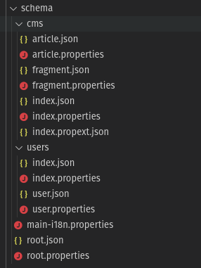

[Prev](./README.md)

# Schemas

The itemize default template project comes with JSON schemas that define the kind of data we can hold, by default they are found in the `schema` folder, this folder also contains all the language information as the schemas are meant to contain multilingual information.

The only necessary files in the schemas folder are `main-i18n.properties`, `root.json`, `root.properties`, and the ones contained in the `users` folder as itemize will complain if these are missing.



 - `main-i18n.properties` contains main language properties to be used in the UI, anything included here is required.
 - `root.json` is the base of the schema and specifies the children modules
 - `root.properties` specifies root i18n information, of which only `app_name`, `app_short_name` and `app_description` are required, the rest are simply custom properties to use accross your app that fit your specific app needs.
 - `users/index.json` is the module entry for the users module
 - `users/user.json` specify the shape of the user, and this can be changed, there are however obligated properties, like username, app_language, app_country, app_currency, role, password and session_id; but you can add other properties like real name, address, about me, profile picture, etc...
 - `users/index.properties` the i18n data for the users module
 - `users/user.properties` the i18n data for the user item definition

Whenever you make a change in the schema you need to run `npm run build-data` and likely rebuild the database.

## Hosting schema

Now we will create a new folder named `hosting` inside at `schema/hosting` and add a new `index.json` file that will be the entry point for our module:

```json
{
    "type": "module",
    "children": [
        "unit"
    ],
    "searchable": true
}
```

Pretty self explanatory, now we want to add an `unit.json` file which will define what a hosting unit is about, first let's define an empty schema for the unit we plan to give hosting

```json
{
    "type": "item",
    "properties": [
    ]
}
```

So far your folder structure should look as:


Now lets start adding properties, one of the things we need is a title so we add such, we will define it as a simple text entry, without any other special properties


```json
{
    "type": "item",
    "properties": [
        {
            "id": "title",
            "type": "text"
        }
    ]
}
```

The next step is to add a description that we can add to the property

```json
{
    "id": "description",
    "type": "text",
    "subtype": "html",
    "specialProperties": {
        "mediaProperty": "attachments",
        "supportsImages": true,
        "supportsVideos": true,
        "supportsFiles": false,
        "supportsContainers": false,
        "supportsCustom": false,
        "supportsExternalLinks": false,
        "supportsLinks": false,
        "supportsQuote": false,
        "supportsRichClasses": false,
        "supportsTitle": true,
        "supportsCustomStyles": false,
        "supportsTemplating": false,
        "supportsLists": false
    }
}
```

Note how we define such as rich text, and define what capabilities the description will have, however, we are also supporting media, images in this case can be attached, but there's no media property currently, so we need to add such as it is where images will be attached for the rich text property

```json
{
    "id": "attachments",
    "type": "files",
    "specialProperties": {
        "smallDimension": "320x",
        "mediumDimension": "640x",
        "largeDimension": "1024x"
    },
    "hidden": true,
    "nullable": true
}
```

The special required properties, small/medium/large dimension are used to define image conversion values; images are resized (if they are larger than) and converted into jpg for the given values; 1024x represents for example the width of the image, as it will be resized based on width, x768 is also valid, as well as 1024x768; they are all valid sizes, but in order to keep aspect ratio, only one is given

However a single specific image is also required, notice how the type of the attachments is plural "files" but the type of a single image is "file" singular.

```json
{
    "id": "image",
    "type": "file",
    "specialProperties": {
        "imageUploader": true,
        "smallDimension": "128x",
        "mediumDimension": "256x",
        "largeDimension": "512x"
    }
}
```

In this case it is explicitly specified to expect an image uploader, as in images as the content type.

The next thing we need is a way for define address, luckily itemize comes with support for geographical attributes which uses postgis under the hood, the type in question is named "location"

```json
{
    "id": "address",
    "type": "location",
    "specialProperties": {
        "maxSearchRadius": 100,
        "searchRadiusInitialPrefill": 50,
        "searchRadiusUnit": "km",
        "searchRadiusImperialUnit": "mi"
    }
}
```

The special properties in these scenario are the maximum search radius, which is going to be 100km as the radius unit is km; an alternate unit is used which in this case is miles; which will be used when itemize detects a country that uses miles (basically just USA), the max limit will still be the 100km or 62.13mi.

Now we want to be able to define the type of our unit, for such will use a simple string, the difference between string and text is that text is made with full text search support in mind, whereas string are made for short simple values, that are searched either partially or by exact values, in this case, exact value is used.

```json
{
    "id": "unit_type",
    "type": "string",
    "subtype": "exact-value",
    "values": [
        "room",
        "apartment",
        "house"
    ]
}
```

Now we need some special properties to define our booking status first we add a booked property

```json
{
    "id": "booked",
    "type": "boolean",
    "hidden": true
}
```

It's a simple boolean that specifies whether the current unit is booked however having the unit booked is not enough, we want to also be able to tell whom has it booked, for that we use the very powerful reference.

```json
{
    "id": "booked_by",
    "type": "string",
    "subtype": "reference",
    "nullable": true,
    "specialProperties": {
        "referencedModule": "users",
        "referencedItemDefinition": "user",
        "referencedSearchProperty": "username",
        "referencedDisplayProperty": "username",
        "referencedFilteringPropertySet": {
            "role": {
                "exactValue": "USER"
            }
        }
    },
    "readRoleAccess": ["&OWNER"],
    "editRoleAccess": [],
    "searchable": false
}
```

This last one we will use for this and it's special, for once it's a string but the subtype is reference, reference is one of the most powerful subtypes in itemize, given ids are strings, a reference subtype means that 'this is the id of another item'; and with the special properties we define that the module is going to be users, item is going to be a user, and we want to search and display by username; also we are filtering and only enabling users with the role of USER.

Note that references are not checked, and it's possible to put an arbitrary string value in the booked_by value if the permissions are valid.

Because we don't want our unit owner to be able to put any user they want here, we will make the field readOnly by the owner of the unit, and none else will be able to read it (by default everything is public), also we will disable editing, none can edit this field (we will take care of bookings later).

## Preparing the Schema

After adding the module to our root tree as such

```json
{
  "type": "root",
  "children": [
    "users",
    "cms",
    "hosting"
  ],
  "i18n": "main-i18n.properties"
}
```

You should then rebuild using `npm run build-data` however, it will fail, that's because we have missing our schema properties in the languages we support, the error you should get will be the following:


## Adding the missing properties

The itemize builder will tell you what you are missing and what should come in the given missing files, however, for the purpose of this tutorial you might just copy and paste the following definitions, given we decided to use both english and spanish this should suffice.

 - `index.properties`

```properties
[en]

name = hosting
search_field_label = search hosting
search_field_placeholder = search hosting
search_keywords = hosting
search_value_too_large = search is too long

[es]

name = hospedaje
search_field_label = buscar hospedaje
search_field_placeholder = buscar hospedaje
search_keywords = hospedaje
search_value_too_large = la búsqueda es demasiado larga
```

 - `unit.properties`

```properties
[en]

name = hosting unit
search_field_label = search hosting
search_field_placeholder = search hosting
search_keywords = unit
search_value_too_large = search is too long

properties.title.label = title
properties.title.placeholder = add a title to your hosting unit
properties.title.search.label = filter by title
properties.title.search.placeholder = filter by title
properties.title.error.NOT_NULLABLE = title cannot be missing
properties.title.error.TOO_LARGE = title is too long

properties.description.label = description
properties.description.placeholder = write a description
properties.description.search.label = search in description
properties.description.search.placeholder = search in description
properties.description.error.NOT_NULLABLE = description cannot be missing
properties.description.error.TOO_LARGE = description is too long
properties.description.error.MEDIA_PROPERTY_TOO_LARGE = too many files attached

properties.image.label = image
properties.image.placeholder = provide an image for your unit
properties.image.error.NOT_NULLABLE = you must provide an image
properties.image.error.TOO_LARGE = the image is too large, it must not exceed 5MB

properties.address.label = address
properties.address.placeholder = provide the unit address
properties.address.search.label = destination
properties.address.search.placeholder = where are you going?
properties.address.search.radius.label = search radius
properties.address.search.radius.placeholder = search radius
properties.address.error.RADIUS_MUST_BE_SPECIFIED = need to provide a radius
properties.address.error.RADIUS_TOO_MANY_DECIMALS = search radius has too many decimals
properties.address.error.RADIUS_TOO_LARGE = search radius is too large
properties.address.error.RADIUS_TOO_SMALL = search radius is too small
properties.address.error.RADIUS_INVALID_VALUE = search radius is invalid
properties.address.error.TOO_LARGE = the address is too long
properties.address.error.NOT_NULLABLE = you must provide an address

properties.unit_type.label = unit type
properties.unit_type.placeholder = provide the unit type
properties.unit_type.search.label = unit type
properties.unit_type.search.placeholder = choose the unit type
properties.unit_type.values.room = private room
properties.unit_type.values.apartment = apartment
properties.unit_type.values.house = entire house
properties.unit_type.null_value = unspecified
properties.unit_type.search.null_value = any type
properties.unit_type.error.NOT_NULLABLE = you must provide an unit type

properties.booked_by.label = booked by
properties.booked_by.placeholder = booked by

[es]

name = unidad de hospedaje
search_field_label = buscar hospedaje
search_field_placeholder = buscar hospedaje
search_keywords = unit
search_value_too_large = la búsqueda es demasiado larga

properties.title.label = título
properties.title.placeholder = añada un título a su hospedaje
properties.title.search.label = filtrar por título
properties.title.search.placeholder = filtrar por título
properties.title.error.NOT_NULLABLE = el título no puede quedarse en blanco
properties.title.error.TOO_LARGE = el título es demasiado largo

properties.description.label = descripción
properties.description.placeholder = escriba una descripción
properties.description.search.label = buscar en la descripción
properties.description.search.placeholder = buscar en la descripción
properties.description.error.NOT_NULLABLE = falta la descripción
properties.description.error.TOO_LARGE = la descripción es muy larga
properties.description.error.MEDIA_PROPERTY_TOO_LARGE = ha añadido demasiados archivos

properties.image.label = imágen
properties.image.placeholder = provea una imagen de su unidad
properties.image.error.NOT_NULLABLE = debe proveer una imágen
properties.image.error.TOO_LARGE = el archivo es muy grande, no debe pasar de los 5MB

properties.address.label = dirección
properties.address.placeholder = provea la dirección de su unidad
properties.address.search.label = destino
properties.address.search.placeholder = ¿Hacia donde te diriges?
properties.address.search.radius.label = radio de búsqueda
properties.address.search.radius.placeholder = radio de búsqueda
properties.address.error.RADIUS_MUST_BE_SPECIFIED = debe proveer un radio de búsqueda
properties.address.error.RADIUS_TOO_MANY_DECIMALS = el radio de búsqueda tiene demasiados decimales
properties.address.error.RADIUS_TOO_LARGE = el radio de búsqueda es muy grande
properties.address.error.RADIUS_TOO_SMALL = el radio de búsqueda es muy pequeño
properties.address.error.RADIUS_INVALID_VALUE = radio de búsqueda inválido
properties.address.error.TOO_LARGE = la dirección es demasiado larga
properties.address.error.NOT_NULLABLE = debe proveer una dirección

properties.unit_type.label = tipo de unidad
properties.unit_type.placeholder = indique el tipo de unidad
properties.unit_type.search.label = tipo de unidad
properties.unit_type.search.placeholder = escoja el tipo de unidad
properties.unit_type.values.room = habitación privada
properties.unit_type.values.apartment = apartamento
properties.unit_type.values.house = casa
properties.unit_type.null_value = sin especifica
properties.unit_type.search.null_value = cualquiera
properties.unit_type.error.NOT_NULLABLE = debe específicar el tipo de unidad

properties.booked_by.label = reservado por
properties.booked_by.placeholder = reservado por
```

## Update the database

Now that the schema is ready and all the translations are provided for what we currently want to achieve we want to add the support to hold such values in the database, this is a delicate process, granted we are in a development environment so it should be fairly straightforward

`npm run build-database development`

And just blast enter answering yes to every question, it will create all the constaints and tables that are necessary in the development database.

Due to the database and schema update you should restart your server, so that it picks up on those changes.

## What you achieved

 1. Updated the database to support the type of data we want to plug.
 2. Created realtime endpoints to retrieve such data.
 3. Created enpoints to allow to securely search for such data.
 4. Supported two languages.
 5. Enabled the application to be able to cache these resources offline (you might notice an update app message on your application currently as itemize has caught on the changes), this is because the client side cache has been updated as well.

So we are pretty much done on the server side and are ready to start adding the fields right into our application and start making what is important the functionality for the app that our users will interact with.

We will come back later for the server side as we want to make our application more complex and create custom behaviours.

## Next Step

[Next](./02-adding.md)