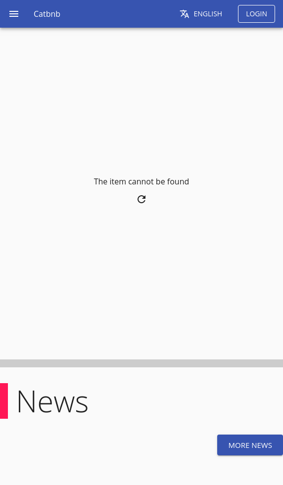
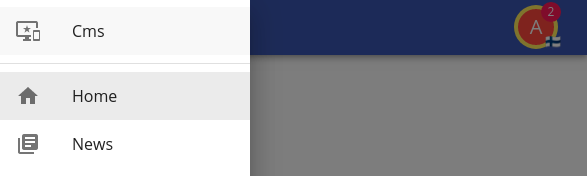
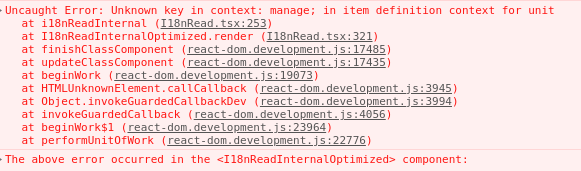
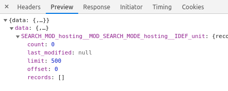

[Prev](./01-schemas.md)

# Adding Units

In this step we are going to build the UI that the user is going to use in order to add hosting units with your server up and running (and you logged as the admin user) you should currently have something as:



Or if you are logged in (log in as admin with the password that itemize generated that should be in your logs) the navigation bar should come as:


Which after accessing the burger menu makes you realize what your options are:



So now we need:

 1. An option in the list to display the current units.
 2. In such screen a way to add new units to the list.

Note that all the look and feel of itemize is customizable, but we will use the fast prototyping route, and use what itemize is giving us to work with; you can change anything, remove headers, navigation bars, signup dialogs, etc... but we are going to leave it as it is because our interest is to ship fast and have that MVP ready.

## Add the option to the list

Our repository currently holds the basic fast prototyping material ui in a fast prototyping file named mui-core, and while it contains some icons, it does not contain all the icons, only those used by fast prototyping; so we want to add a new dependency.

`npm install --save @material-ui/icons`

Now we get to the file named `src/client/app.tsx` and find a variable named `MENU_ENTRIES` and add a new entry, remember to import the respective icon.

```tsx
{
    path: "/hosting",
    icon: <HomeWorkIcon />,
    module: "hosting",
    idef: "unit",
    i18nProps: {
        id: "manage",
        capitalize: true,
    },
    roles: ["USER", "ADMIN"],
},
```

Now given that we want to fast develop, we just need to run `npm run webpack-dev` and since service workers are not active, and we are bypassing the cache, we should get served the new version.

And the moment you attempt to open the menu, the app crashed, what happened?...



This demonstrates one of the behaviors of itemize, it is extremely strict if something doesn't look right (this should be caught by the tests); on purpose itemize will crash when something is not properly translated, because having a website with missing text and translations is unacceptable for your users.

In this case it's because the manage id, which doesn't not exist, the menu refuses to simply show "manage" as a label, and as such we need to create a new key, we go to the `unit.properties` and add to them.

```properties
custom.manage = manage units
```

And in spanish

```properties
custom.manage = administrar unidades
```

Now you need to rebuild the schema, remember these labels are part of the structure of the data tree; when building separate schemas are built for different languages, so not all is bundled together; run `npm run build-data` and refresh the browser, the menu should now work just fine.

Remember this only works because we are developing, and our cache is disabled as well as our service worker, on normal production circumstances itemize tries to be efficient and use one of its several caches, so a server restart is required to pick up the new build; servers should be seen as tied to what they serve, but on development we bypass that.

Your menu should now look like:


Click it!... and then there's nothing, because there's no such page as `/hosting`

## Listing all the hosting units

Now we want to list all the hosting units we own, currently 0 because we haven't added any, but let's do it anyway and we take care of the right look later once we start adding.

First we need to create the hosting page for that endpoint, just create `src/client/pages/hosting/index.tsx` in there

```tsx
import React from "react";

import { ModuleProvider } from "@onzag/itemize/client/providers/module";
import { ItemProvider } from "@onzag/itemize/client/providers/item";
import I18nRead from "@onzag/itemize/client/components/localization/I18nRead";
import TitleSetter from "@onzag/itemize/client/components/util/TitleSetter";
import Route from "@onzag/itemize/client/components/navigation/Route";
import UserDataRetriever from "@onzag/itemize/client/components/user/UserDataRetriever";
import Entry from "@onzag/itemize/client/components/property/Entry";
import { SearchLoaderWithPagination } from "@onzag/itemize/client/fast-prototyping/components/search-loader-with-pagination";
import View from "@onzag/itemize/client/components/property/View";

/**
 * This is our main hosting function that defines
 * the entry point
 */
export function Hosting() {
    return (
        <ModuleProvider module="hosting">
            {/* this part reads the name from the module hosting as it is in the properties file */}
            <I18nRead id="name" capitalize={true}>
                {(i18nCMS: string) => {
                    return (
                        <TitleSetter>
                            {i18nCMS}
                        </TitleSetter>
                    );
                }}
            </I18nRead>
            {/* now we define a route for the unit list */}
            <Route
                path="/hosting"
                exact={true}
                component={UnitList}
            />
        </ModuleProvider>
    );
}

/**
 * This will be displayed when we are in /hosting main route
 */
export function UnitList() {
    // first we need to get the user data to find the current user that we
    // are
    return (
        <UserDataRetriever>
            {(userData) => (
                // Now we need an item provider to provide for our units
                <ItemProvider
                    itemDefinition="unit"
                    searchCounterpart={true}
                    // this is very important, we need a state for the title property
                    // otherwise if a state is not provided, our entry will not work
                    // at all (as in be totally invisible because it doesn't even know if it should display)
                    // holding a state is expensive for itemize, so keep it effective
                    properties={
                        [
                            "title",
                        ]
                    }
                    automaticSearch={
                        {
                            // we search by title, as we allow that as user input
                            searchByProperties: [
                                "title",
                            ],
                            // we request, title, address, and image
                            requestedProperties: [
                                "title",
                                "address",
                                "image",
                            ],
                            // we start from offset 0
                            offset: 0,
                            // and limit our search until 500, which is the maximum itemize allows
                            // on non-traditional search (it can be changed)
                            limit: 500,
                            // we specify that the creator must be us
                            createdBy: userData.id,
                            // and we want the search results to be stored
                            // in the navigation itself, when the search is done
                            // the results will be stored and as such we will be able to go
                            // back and forth, this is often recommended, this id is just
                            // a random unique id for the navigation
                            storeResultsInNavigation: "unit-search"
                        }
                    }
                    // now we tell here what to load, we will use the same id
                    // as before, the item will avoid search if it finds that a search
                    // result already exists in navigation, and will load from there
                    // note that searches are entire stateful values and will
                    // affect even the values of entries, so our text field id="title"
                    // will be affected to reflect the search
                    loadSearchFromNavigation="unit-search"
                    // this is the memory management that is defined in itemize itself
                    // itemize will cache on memory unless told to release such data
                    // this is useful, for example, for some forms, that you might just
                    // want to keep on the same value forever, but in this case, we want to wipe
                    // anyway search results will be stored in navigation history
                    cleanOnDismount={{
                        cleanSearchResultsOnAny: true,
                    }}
                >
                    {/* This little entry here will allows us to filter by title, you might notice
                    there's no state handling, it's uncessary, itemize will handle the state
                    and event listeners for you */}
                    <Entry id="title" searchVariant="search" />
                    {/* Now we need to load the search results, this is a fast prototyping component
                    that loads the search results and adds a pagination element, you should be able
                    to use a standard search loader otherwise, all of them are paged, but you can put
                    a rather large search size, keep in mind that the search loader when the search
                    was made in a non traditional way needs to fetch from the server again per page
                    you load, in offline mode, if caching is enabled it will use indexed db */}
                    <SearchLoaderWithPagination id="unit-search-loader" pageSize={12}>
                        {(arg, pagination, noResults) => (
                            <>
                                {
                                    arg.searchRecords.map((r) => (
                                        <ItemProvider {...r.providerProps}>
                                            <View id="image"/>
                                            <View id="title"/>
                                            <View id="address" rendererArgs={{ hideMap: true }} />
                                        </ItemProvider>
                                    ))
                                }
                                {pagination}
                            </>

                        )}
                    </SearchLoaderWithPagination>
                </ItemProvider>
            )}
        </UserDataRetriever>
    )
}
```

Read the comments so you can see what is happening, once it's ready you can add the file into the router right in the `app.tsx` add the line

```tsx
<Route path="/hosting" component={Hosting}/>
```

In the App() function, now refresh your browser.


But of course as expected nothing is displayed, we simply do not have any hosting units at all to be shown here; but if you check your network you should notice this response:



not only that but if you type into the search field, you will realize a new search is performed automatically with the new attributes:


that is because we are using automatic search, and because we have specified to store searches in navigation we can in fact navigate back and forward our searches using your browser native navigation.

## Adding a housing unit

But we need a way, a button to add these housing units properly, let's use a material ui icon button for such thing, in our hosting list file on top of the entry, let's add this.

```tsx
import { IconButton } from "@onzag/itemize/client/fast-prototyping/mui-core";
import Link from "@onzag/itemize/client/components/navigation/Link";
import AddIcon from '@material-ui/icons/Add';
```

```tsx
<Link to="/hosting/new">
    <IconButton>
        <AddIcon/>
    </IconButton>
</Link>
```

Note: Very often the IDE might auto imports from a folder named nodejs, this folder is for internal usage only and will absolutely mess your itemize build causing unexpected behaviour.

Now we need a new function to define that new area, and allow to add a new hosting unit.