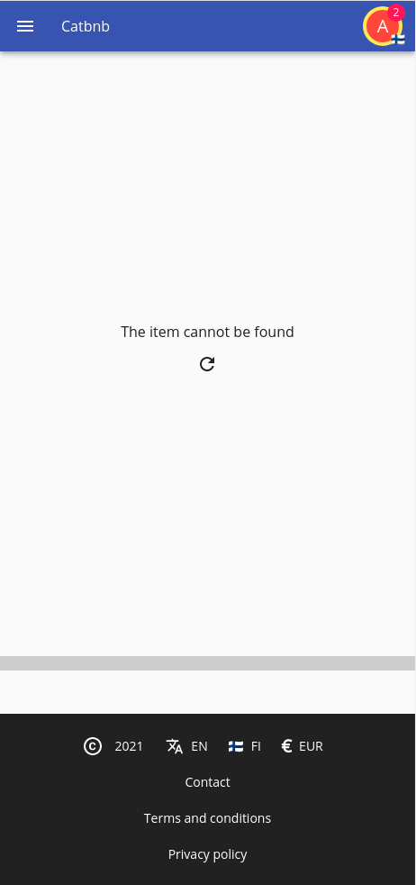
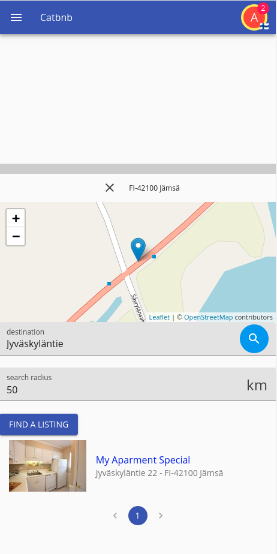
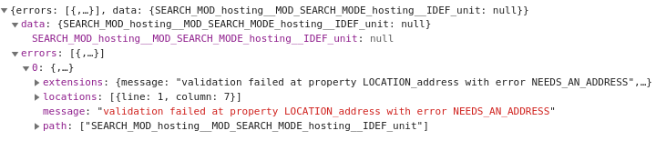
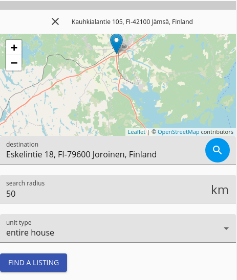

[Prev](./03-editing.md)

# Search

So now we have a way to add and edit hosting units, but we are unable to search for the units in question and find units to book in the place we are going to, and we need to be able to find them; right now our frontpage simply displays a header (which we haven't even set) and news, of which we don't truly have any at this point.


## Clean up the frontpage

We want to wipe out the news and social part from this frontpage, and provide a search instead, so we remove both imports and remove them from the `src/client/pages/frontpage/index.tsx` it should end up looking something as:

```tsx
import React from "react";
import I18nRead from "@onzag/itemize/client/components/localization/I18nRead";
import TitleSetter from "@onzag/itemize/client/components/util/TitleSetter";
import { Hero } from "./hero";

/**
 * Provides the frontpage
 */
export function Frontpage() {
    return (
        <>
            <I18nRead id="app_name" capitalize={true}>
                {(i18nAppName: string) => {
                    return (
                        <TitleSetter>
                            {i18nAppName}
                        </TitleSetter>
                    );
                }}
            </I18nRead>
            <Hero />
        </>
    );
}
```

And now the frontpage after running `npm run webpack-dev`



## Add the search

Now we want to create a file named `search.tsx` in the same folder and fill it with the following content (read the comments for information):

```tsx
import React from "react";

import { ModuleProvider } from "@onzag/itemize/client/providers/module";
import { ItemProvider } from "@onzag/itemize/client/providers/item";
import Entry from "@onzag/itemize/client/components/property/Entry";

import { ListItem, ListItemText, withStyles, WithStyles } from "@onzag/itemize/client/fast-prototyping/mui-core";
import { SearchButton } from "@onzag/itemize/client/fast-prototyping/components/buttons";
import { SearchLoaderWithPagination } from "@onzag/itemize/client/fast-prototyping/components/search-loader-with-pagination";
import Link from "@onzag/itemize/client/components/navigation/Link";
import View from "@onzag/itemize/client/components/property/View";

/**
 * The search style
 */
const searchStyle = {
    image: {
        width: "30%",
        display: "inline-block",
    },
    listingText: {
        padding: "0 1rem",
    },
    listing: {
        transition: "background-color 0.3s",
        cursor: "pointer",
        "&:hover": {
            backgroundColor: "#eee",
        },
    },
    paginator: {
        paddingTop: "1rem",
        display: "flex",
        alignItems: "center",
        justifyContent: "center",
    },
    container: {
        width: "100%",
    },
};

/**
 * The search component will allow us to perform searches to the place we want to travel to
 */
export const Search = withStyles(searchStyle)((props: WithStyles<typeof searchStyle>) => {
    return (
        <ModuleProvider module="hosting">
            <ItemProvider
                itemDefinition="unit"
                loadSearchFromNavigation="frontpage-search"
                searchCounterpart={true}
                properties={[
                    "address"
                ]}
            >
                <Entry id="address" searchVariant="location" />
                <Entry id="address" searchVariant="radius" />

                <SearchButton
                    buttonVariant="contained"
                    buttonColor="primary"
                    i18nId="search"
                    options={{
                        limit: 200,
                        offset: 0,
                        requestedProperties: [
                            "title",
                            "address",
                            "image",
                        ],
                        searchByProperties: [
                            "address",
                        ],
                        orderBy: {
                            address: {
                                direction: "asc",
                                priority: 0,
                                nulls: "last",
                            },
                        },
                        storeResultsInNavigation: "frontpage-search"
                    }}
                />

                <div className={props.classes.container}>
                    <SearchLoaderWithPagination id="search-loader" pageSize={12}>
                        {(arg, pagination, noResults) => (
                            <>
                                {
                                    arg.searchRecords.map((r) => (
                                        <ItemProvider {...r.providerProps}>
                                            <Link to={`/reserve/${r.id}`}>
                                                <ListItem className={props.classes.listing}>
                                                    <View id="image" rendererArgs={
                                                        {
                                                            // we do not want to link images with with <a> tags like
                                                            // the active renderer does by default
                                                            disableImageLinking: true,
                                                            // we want the image size to load by 30 viewport width
                                                            // this is used to choose what image resolution to load
                                                            // so they load faster, we want tiny images
                                                            imageSizes: "30vw",
                                                            imageClassName: props.classes.image
                                                        }
                                                    } />
                                                    <ListItemText
                                                        className={props.classes.listingText}
                                                        primary={<View id="title" />}
                                                        secondary={<View id="address" rendererArgs={{ hideMap: true }} />}
                                                    />
                                                </ListItem>
                                            </Link>
                                        </ItemProvider>
                                    ))
                                }
                                <div className={props.classes.paginator}>
                                    {pagination}
                                </div>
                            </>
                        )}
                    </SearchLoaderWithPagination>
                </div>

            </ItemProvider>
        </ModuleProvider>
    );
});
```

And we need to add the component here in our `frontpage/index.tsx` right under our `<Hero />` component

```tsx
<Search />
```

Remember to add the following in the `unit.properties` file:

```properties
custom.search = find a listing
```

And in spanish:

```properties
custom.search = encuentre un lugar
```

And now you should be able to search by clicking the search button and typing an address



## Memory pollution

You might notice that if (for example) you search a place that holds no properties, and do in fact get 0 results; but then go to the manage units page, your listings are missing as well; this is caused by memory pollution.

Inside of itemize there are no pages, itemize has no notion of the navigation and how our components change from page to page, as a result the previous search and the new search are considered the same, they are part of the same state.

This is because they both hold the same bit in memory, and as such hold the same state; this is one of the things with itemize and the fact the developer needs to manage its memory; itemize simply doesn't know that it hasn't performed the automatic search, it thinks it did because it already holds a state.

Three solutions come to mind:

 1. Specify a diferent version; which will change the slot between the frontpage and your own hostings.
 2. Use automaticSearchForce to override previous results (this however will only work in one way)
 3. Clean the memory on dismount.

And the #3 one is the best choice for this situation, we are telling the component that when it is going to dismount, it should clean the memory in its state, when the new component then mounts it will think that it holds no state and it will then perform a search.

In the `<ItemProvider>` of the `Search` component you should add this bit of code

```tsx
<ItemProvider
    cleanOnDismount={{
        cleanSearchResultsOnAny: true,
    }}
/>
```

You might notice that such option is already in place in the component at the item provider in your own listings, this means that now they won't share the same state as each will clear the other, but remember these two components are sharing the same memory slot; so they cannot appear together, in that case you should rely on a different version to ensure they use different slots.

## Limiting Search

You might notice that if you don't write anything as your destination you do still get search results, this is due to search not being limited and a search being possible when nothing is specified.

We want then to limit the search and provide a nice human readable error for when this happen, note that any kind of listing is a search, and we have to remember that in our listing, we are searching by creator whereas in the frontpage we are searching by address.

Go to your schema to change the way your search schema interacts at `schema/hosting/unit.json` find your address and change the property to be like:

```json
{
    "id": "address",
    "type": "location",
    "specialProperties": {
        "maxSearchRadius": 100,
        "searchRadiusInitialPrefill": 50,
        "searchRadiusUnit": "km",
        "searchRadiusImperialUnit": "mi"
    },
    "searchInvalidIf": [
        {
            "if": {
                "property": "created_by",
                "comparator": "equals",
                "value": {
                    "exactValue": null
                },
                "gate": "and",
                "condition": {
                    "property": "&this",
                    "comparator": "equals",
                    "value": {
                        "exactValue": null
                    }
                }
            },
            "error": "NEEDS_AN_ADDRESS"
        }
    ]
}
```

In itemize there are three special properties, that exist only in search mode, `created_by`, `since`, and `search`; these are variant free and specify values that are search specific for filtering, in this case created_by refers to the creator that we specify in our self list, so the search won't be forbidden.

What this makes now is impossible to make a search without specifying creator or an address, so global searches are now forbidden thanks to this; this is simple schema based security, there are ways for fine tuning security using triggers, but that's another topic we will explore later.

We will now try to build and we are going to get an error when doing `npm run build-data`


This is because we are missing the `NEEDS_AN_ADDRESS` error message, for that we are going to add it to our `unit.properties`

```properties
properties.address.error.NEEDS_AN_ADDRESS = you must provide an address
```

And in spanish

```properties
properties.address.error.NEEDS_AN_ADDRESS = debe proveer una dirección
```

At this point everything should work normally, however just for testing go to our `hosting/index.tsx` file and search for the search functionality that builds up the list and comment out the `createdBy` line, this should cause search not to work anymore due to the newly introduced security policy.

```tsx
// we specify that the creator must be us
// createdBy: userData.id,
```

However if you refresh the page you will notice that it works just fine still, well rember `storeResultsInNavigation: "unit-search"` this line? it is picking your search results from the navigation, you will need to open a new page (remember to keep devtools open not to hit the service worker), and load the page, and you should be met with the security policy



Anyway, let's go back to the previous code and uncomment that line, so we are back to our functional build.

## Filter by type

We also would like to allow the user to filter by type and that's easy to achieve, first we need to add the state for the "unit_type" in both the search by property, and the state properties.

At the top of the provider:

```tsx
<ItemProvider
    properties={[
        "address",
        "unit_type"
    ]}
```

And in the search button

```tsx
{
    searchByProperties: [
        "address",
        "unit_type",
    ]
}
```

And simply add a new entry

```tsx
<Entry id="unit_type" searchVariant="search" />
```

And now your page looks like



## What you achieved

 1. Edited the frontpage to search listings by address given a radius.
 2. Allowed to search by listing type.
 3. Added security policies to prevent a global search.

So we are now ready for creating bookings.

## Next

[Next](./04-search.md)