[Prev](./04-search.md)

# Request

Now we need to have a way to make booking requests on the properties that we have added, and these requests will need to be approved, denied or ignored.

We want to send an email notification to the host when this occurs and to the requested as well when they have received a positive or negative answer.

## Creating the request schema

First we want to create the request schema at `hosting/request.json`, that will be used to define the item that specifies how a request to a property is to be generated, we will define such as:

```json
{
    "type": "item",
    "properties": [
        {
            "id": "message",
            "type": "text",
            "subtype": "plain",
            "nullable": true,
            "searchable": false,
            "maxLength": 255,
            "minLength": 25,
            "readRoleAccess": ["&OWNER", "OWNER_OF_UNIT"],
            "editRoleAccess": []
        },
        {
            "id": "check_in",
            "type": "date",
            "invalidIf": [
                {
                    "if": {
                        "property": "&this",
                        "comparator": "less-than",
                        "value": {
                            "exactValue": "today"
                        },
                        "method": "date"
                    },
                    "error": "DATE_IS_IN_THE_PAST"
                }
            ],
            "searchInvalidIf": [],
            "editRoleAccess": []
        },
        {
            "id": "check_out",
            "type": "date",
            "invalidIf": [
                {
                    "if": {
                        "property": "&this",
                        "comparator": "less-or-equal-than",
                        "value": {
                            "property": "check_in"
                        },
                        "method": "date"
                    },
                    "error": "CHECK_OUT_IN_THE_PAST_OR_SAME_DAY"
                }
            ],
            "editRoleAccess": []
        },
        {
            "id": "status",
            "type": "string",
            "subtype": "exact-value",
            "values": ["WAIT", "APPROVED", "DENIED"],
            "default": "WAIT",
            "coerceNullsIntoDefaultAfterSubmit": true,
            "nullable": true,
            "createRoleAccess": [],
            "editRoleAccess": ["OWNER_OF_UNIT"]
        }
    ],
    "searchLimiters": {
        "condition": "OR",
        "parenting": true,
        "createdBy": true
    },
    "mustBeParented": true,
    "canBeParentedBy": [
        {
            "module": "hosting",
            "item": "unit"
        }
    ],
    "ownerReadRoleAccess": ["&OWNER", "OWNER_OF_UNIT"],
    "editRoleAccess": ["OWNER_OF_UNIT"]
}
```

Because now we are parenting this to a housing unit object we must specify that we are allowing this at `hosting/unit.json` by adding

```json
{
    "parentingRoleAccess": {
        "hosting/request": ["&ANYONE_LOGGED"]
    }
}
```

This means that anyone logged can create a request and parent it by the given unit.

Remembering to add it to the `hosting/index.json` module as a children

```json
{
    "type": "module",
    "children": [
        "unit",
        "request"
    ],
    "searchable": true
}
```

You will notice a couple of things, both the date of check in and check out hold custom errors as they should be kept into a reasonable range and not a date in the past, they are using the conditional rule sets, which allows for schemas to hold some cross referenced shape; the "date" method allows for comparing dates, and "today" is an special value that refers to this same day.

The request limiter means that no search can be requested without the attributes specified in there, in this case, we are demanding for a parenting rule to be defined, this means no global searches without attributes can be taken.

We are defining that requests must be parented by something, and we define that something to be module hosting, item unit; which means every request will have to be a children of a hosting unit.

Anyone who is logged can make a request, and we are surprisingly allowing anyone to search these requests, this will allow us to get all the requests for a given listing and make them disabled so that they cannot be selected; however this could also let some data leak, the message that we are defining and the owner of who made that request, this is information we don't want anyone to access, except the creator or whoever owns the unit.

For this scenario we are using the `["&OWNER", "OWNER_OF_UNIT"]` role access rule, and defining them both in the `ownerReadRoleAcces` and `readRoleAccess` of the message, but you might realize that there's no such thing as an `OWNER_OF_UNIT` in our roles, not to add that role is highly specific to the request itself.

In that sense we need to define a custom role, custom roles are a server side mechanism, we go to our `src/server/index.ts` file and add for the custom properties on the initialization.

Right after our `seoRules` on a new object we must add:

```ts
{
    customRoles: [
        {
            role: "OWNER_OF_UNIT",
            item: ["request"],
            module: ["hosting"],
            grant: async (arg) => {
                // if there's no parent
                // we give false
                if (!arg.parent) {
                    return false;
                }

                const parentItem = await arg.cache.requestValue(
                    arg.parent.type,
                    arg.parent.id,
                    arg.parent.version,
                    {
                        // the memory cache is a volatile and extremely fast but not realtime
                        // cache that sits directly into the ram, usually values are requested
                        // from redis, and redis is kept in realtime, but the memory cache is static
                        // however it lives only for a couple of milliseconds, in practique, specially
                        // when you expect to reuse the same value several times on a row on
                        // different operations, using memory cache is endorsed, honestly small
                        // millisecond windows of non-realtimeness is barely an inconvenience for
                        // all the extra speed this adds; on critical operations, you might not
                        // want to use it
                        useMemoryCache: true,
                    }
                );

                // if we get no parent, weird, because there should be one
                // always but who knows about that one edge case, we return false
                if (!parentItem) {
                    return false;
                }

                // now we are the owner if the parent is our requester
                return parentItem.created_by === arg.tokenData.id;
            }
        }
    ],
}
```

What we are doing is that we are creating a role that only exists withgin the hosting/unit item, and we grant that role by checking the parent of the item, custom roles can be extensive and have a degree of relationship with triggers.

Now we do need to define the properties file for the schema we have just created:

```properties
[en]

name = booking request
search_field_label = search for a booking request
search_field_placeholder = type information about the booking request
search_keywords = booking, request
search_value_too_large = search is too long

custom.request = make request

properties.message.label = provide a message
properties.message.placeholder = write a message to your potential host
properties.message.description = A message to the host is very important to improve your chances of getting a booking request accepted
properties.message.error.TOO_LARGE = the message is too long
properties.message.error.TOO_SMALL = the message is too short

properties.check_in.label = check in date
properties.check_in.placeholder = check in date
properties.check_in.search.range.from.label = from check in date
properties.check_in.search.range.from.placeholder = from check in date
properties.check_in.search.range.to.label = to check in date
properties.check_in.search.range.to.placeholder = to check in date
properties.check_in.error.DATE_IS_IN_THE_PAST = the date cannot be in the past
properties.check_in.error.NOT_NULLABLE = you must specify a check in date
properties.check_in.error.INVALID_VALUE = invalid date
properties.check_in.error.FROM_LARGER_THAN_TO = date range is invalid
properties.check_in.error.TO_SMALLER_THAN_FROM = date range is invalid

properties.check_out.label = check out date
properties.check_out.placeholder = check out date
properties.check_out.search.range.from.label = from check out date
properties.check_out.search.range.from.placeholder = from check out date
properties.check_out.search.range.to.label = to check out date
properties.check_out.search.range.to.placeholder = to check out date
properties.check_out.error.CHECK_OUT_IN_THE_PAST_OR_SAME_DAY = the check out cannot be the same day or in the past to the check in
properties.check_out.error.NOT_NULLABLE = you must specify a check out date
properties.check_out.error.INVALID_VALUE = invalid date
properties.check_out.error.FROM_LARGER_THAN_TO = date range is invalid
properties.check_out.error.TO_SMALLER_THAN_FROM = date range is invalid

properties.status.label = status of this request
properties.status.placeholder = status of this request
properties.status.values.WAIT = waiting for answer
properties.status.values.APPROVED = approved stay
properties.status.values.DENIED = denied stay
properties.status.null_value = unspecified
properties.status.search.label = search by status of request
properties.status.search.placeholder = search by status of request
properties.status.search.null_value = any
properties.status.error.NOT_NULLABLE = you must specify a status

[es]

name = pedido de reservación
search_field_label = búsque un pedido de reservación
search_field_placeholder = inserte información referente al pedido
search_keywords = reservación, pedido
search_value_too_large = los parámetros de búsqueda son demasiado largos

custom.request = hacer pedido

properties.message.label = escriba un mensaje
properties.message.placeholder = escriba un mensaje a su anfitrión potencial
properties.message.description = El mensaje es algo importante ya que ayuda a incrementar tus probabilidad de que acepten tu pedido de reserva
properties.message.error.TOO_LARGE = el mensaje es muy corto
properties.message.error.TOO_SMALL = el mensaje es muy largo

properties.check_in.label = día de check in
properties.check_in.placeholder = día de check in
properties.check_in.search.range.from.label = desde día de check in
properties.check_in.search.range.from.placeholder = desde día de check in
properties.check_in.search.range.to.label = hasta día de check in
properties.check_in.search.range.to.placeholder = hasta día de check in
properties.check_in.error.DATE_IS_IN_THE_PAST = el día no puede ser en el pasado
properties.check_in.error.NOT_NULLABLE = debe especificar una fecha
properties.check_in.error.INVALID_VALUE = la fecha es inválida
properties.check_in.error.FROM_LARGER_THAN_TO = el rango es inválido
properties.check_in.error.TO_SMALLER_THAN_FROM = el rango es inválido

properties.check_out.label = día de check out
properties.check_out.placeholder = día de check out
properties.check_out.search.range.from.label = desde día de check out
properties.check_out.search.range.from.placeholder = desde día de check out
properties.check_out.search.range.to.label = hasta día de check out
properties.check_out.search.range.to.placeholder = hasta día de check out
properties.check_out.error.CHECK_OUT_IN_THE_PAST_OR_SAME_DAY = el día de check out no puede ser el mísmo o en el pasado del check in
properties.check_out.error.NOT_NULLABLE = debe especificar una fecha
properties.check_out.error.INVALID_VALUE = la fecha es inválida
properties.check_out.error.FROM_LARGER_THAN_TO = el rango es inválido
properties.check_out.error.TO_SMALLER_THAN_FROM = el rango es inválido

properties.status.label = estado del pedido
properties.status.placeholder = estado del pedido
properties.status.values.WAIT = en espera
properties.status.values.APPROVED = aprovado
properties.status.values.DENIED = denegado
properties.status.null_value = sin especificar
properties.status.search.label = busque por estado de pedido
properties.status.search.placeholder = busque por estado de pedido
properties.status.search.null_value = cualquiera
properties.status.error.NOT_NULLABLE = debe especificar un estado
```

And now we have just made the schema and endpoints we are required in order to create these reservations and requests; in order to see this in action remember to run `npm run build-data` `npm run build-database development` and `npm run install` to rebuild the server and then restart your server.

## Building the reservation request page

We need now to build the page that will allow us to view the property we want to book and then create a reservation mechanism on it, for that we will create a page at `src/client/pages/reserve/index.tsx` and we will fill it with this simple request page, it's nothing fancy, but it will do the trick:

```tsx
import React from "react";

import { ModuleProvider } from "@onzag/itemize/client/providers/module";
import { IActionSubmitResponse, ItemProvider } from "@onzag/itemize/client/providers/item";
import TitleSetter from "@onzag/itemize/client/components/util/TitleSetter";
import Entry from "@onzag/itemize/client/components/property/Entry";
import View from "@onzag/itemize/client/components/property/View";
import Typography from "@mui/material/Typography";
import { SubmitButton } from "@onzag/itemize/client/fast-prototyping/components/buttons";
import SubmitActioner from "@onzag/itemize/client/components/item/SubmitActioner";
import Snackbar from "@onzag/itemize/client/fast-prototyping/components/snackbar";
import { TextReader } from "@onzag/itemize/client/components/property/Reader";

interface IReserveHostingProps {
    match: {
        params: {
            id: string;
        };
    };
}

/**
 * Page to add or edit a hosting unit
 */
export function ReserveHosting(props: IReserveHostingProps) {
    const idToReserve = props.match.params.id || null;
    const newRequestRedirectCallback = (data: IActionSubmitResponse) => `/reserve/${idToReserve}/request/${data.id}`;
    return (
        <ModuleProvider module="hosting">
            <ItemProvider
                itemDefinition="unit"
                // we are adding the id here that we plan to load
                // the null slot is the same as not specified
                forId={idToReserve}
                // these are the properties that
                // we have a state for
                properties={[
                    "title",
                    "description",
                    "attachments",
                    "image",
                    "address",
                    "unit_type",
                ]}
            >
                {/* we will use the title property and read it raw and use such
                property value as the title value for the window, we use TextReader because the text type is complex
                even when the Reader will work just fine, this infers the type correctly */}
                <TextReader id="title">
                    {(title) => (
                        <TitleSetter>
                            {title && title.value}
                        </TitleSetter>
                    )}
                </TextReader>
                <Typography variant="caption">
                    <View id="unit_type" />
                </Typography>
                <Typography variant="h2">
                    <View id="title" />
                </Typography>
                <View id="description" />
                <View id="image" />
                <View id="address" />
            </ItemProvider>

            <hr />

            <ItemProvider
                itemDefinition="request"
                properties={[
                    "message",
                    "check_in",
                    "check_out",
                ]}
            >
                <Entry id="message" />
                <Entry id="check_in" />
                <Entry id="check_out" />

                <SubmitButton
                    i18nId="request"
                    buttonColor="primary"
                    buttonVariant="contained"
                    options={{
                        properties: [
                            "message",
                            "check_in",
                            "check_out",
                        ],
                        restoreStateOnSuccess: true,
                        parentedBy: {
                            item: "hosting/unit",
                            id: idToReserve,
                        }
                    }}
                    redirectOnSuccess={newRequestRedirectCallback}
                    redirectReplace={true}
                />

                <SubmitActioner>
                    {(actioner) => (
                        <Snackbar
                            id="request-error"
                            severity="error"
                            i18nDisplay={actioner.submitError}
                            open={!!actioner.submitError}
                            onClose={actioner.dismissError}
                        />
                    )}
                </SubmitActioner>
            </ItemProvider>
        </ModuleProvider>
    );
}
```

Then register this new route in `src/client/app.tsx` as:

```tsx
<Route path="/reserve/:id" component={ReserveHosting}/>
```

Go find your property in the search and then click on it and you should be able to find it and make a reservation for it.

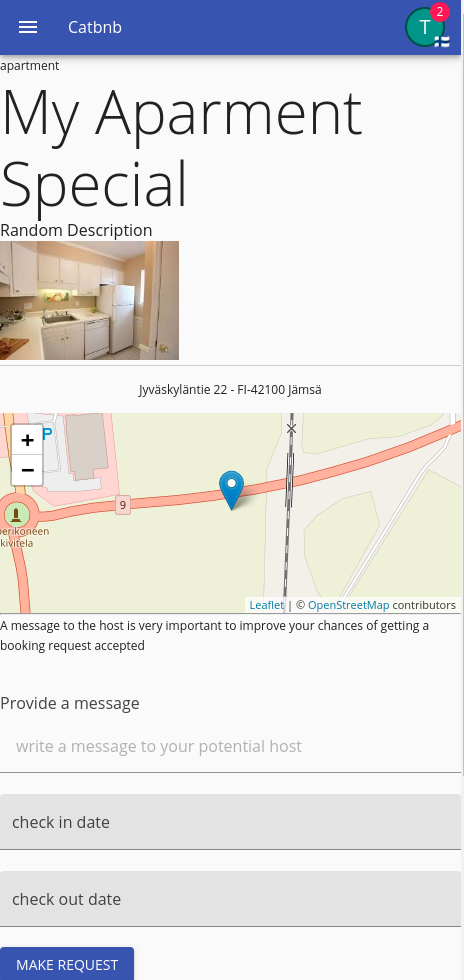

You might realise that once you click the button to make a reservation, what occurs is that all the fields get cleared out and the url changes on sight, this is because the reservation was made and as specified with `restoreStateOnSuccess: true` the state was restored to the original state, which was nothing, as a result it clears up; it has not failed despite that seeming to be the case, just that clearing up the fields means they are invalid as that's why they show red, we should have changed location once we changed the url, but since we stick in place, they have no option than show that they are now in an invalid state.

## Sending email notifications

Now that a reservation request has been made to the given property we want now to ensure that to send an email notification to the host about it so that they are aware of what just happened.

Plase make sure that you have started the server with the `FAKE_EMAILS=true` environment variable, so that we do not send any unwanted email (if you have set a configuration for it) and it is anyway nicer.

In order to send emails we again need to go back to the server side, and create a new trigger, go under where you have just added the custom roles and add a new custom trigger with this shape

```ts
{
    customTriggers: {
        item: {
            io: {
                "hosting/request": async (arg) => {
                    // when the action refers to a creation that is the item
                    // has been created succesfully
                    if (arg.action === IOTriggerActions.CREATED) {
                        // let's get the user that did the request itself
                        const requesterUser = await arg.appData.cache.requestValue(
                            "users/user",
                            // this is the request, the arg.value
                            arg.newValue.created_by as string,
                            null,
                        );
                        // the unit that was to be hosted, that of course, relates to the parent
                        const hostingUnit = await arg.appData.cache.requestValue(
                            "hosting/unit",
                            arg.newValue.parent_id as string,
                            arg.newValue.parent_version as string,
                        );
                        // and the user that is the hosting person
                        const targetUser = await arg.appData.cache.requestValue(
                            "users/user",
                            hostingUnit.created_by,
                            null,
                        );

                        // let's get the request item definition to read some data from it
                        const requestIdef = arg.appData.root.registry["hosting/request"];
                        const i18nData = requestIdef.getI18nDataFor(targetUser.app_language);

                        // now let's use the mail service to send a template email
                        // based on a fragment
                        arg.appData.mailService.sendTemplateEmail({
                            // this is the email handle to be sent from [user]@mysite.com
                            fromEmailHandle: i18nData.custom.request_notification_email_handle,
                            // this is the username that it will be sent as
                            fromUsername: i18nData.custom.request_notification_email_username,
                            // the subject line, we are adding the title
                            subject: localeReplacer(i18nData.custom.request_notification_email_subject, hostingUnit.title),
                            // whether the user can unsubscribe via email address, allow users
                            // to unsubscribe as a norm unless they are very critical emails
                            canUnsubscribe: true,
                            // where is the subscription state stored, we will reuse the e_notifications
                            // boolean that exist within the user, if this boolean is false, the email
                            // won't be sent because the user is unsubscribed
                            subscribeProperty: "e_notifications",
                            // the unsubscription email will be sent, but it will not check if the user
                            // is unsubscribed
                            ignoreUnsubscribe: false,
                            // other important properties in order to send the message, we want to ensure
                            // the user is validated and not just spam
                            confirmationProperties: ["e_validated"],
                            // arguments to render the template
                            args: {
                                request_notification_requester: requesterUser.username,
                                request_notification_check_in: formatDate(targetUser.app_language, arg.newValue.check_in as string),
                                request_notification_check_out: formatDate(targetUser.app_language, arg.newValue.check_out as string),
                            },
                            // the item definition that we will use as template, we will use a fragment
                            itemDefinition: "cms/fragment",
                            // the id of the item definition we want to use, this is a custom id
                            id: "NOTIFICATION_EMAIL",
                            // the version, so we have different versions per language
                            version: targetUser.app_language,
                            // the property we want to pull from that item definition
                            property: "content",
                            // who we are sending to, passing a value from the cache is more efficient
                            to: targetUser,
                        });
                    }
                    return null;
                }
            }
        }
    }
}
```

However we have added new information for our language info that we pick from the schema at `request.properties`

```properties
custom.request_notification_email_handle = requests
custom.request_notification_email_username = requests
custom.request_notification_email_subject = new request on {0}
```

And in spanish:

```properties
custom.request_notification_email_handle = reservaciones
custom.request_notification_email_username = reservaciones
custom.request_notification_email_subject = nuevo pedido en {0}
```

Now you need to kill the server, run `npm run install` to rebuild the server `npm run build-data` to update the schema, remember to restart the server with `FAKE_EMAILS=true` otherwise or you send real emails or we hit an error.

Now you might notice that once you create a request, nothing happens at all, no email is being sent whatsoever; this is because not only your user does not have an email associated with his account, but such email is not validated, now that we have fake emails on, we might as well see how this dynamic goes.

Go to your account that you have used to post your listing and go to your profile.

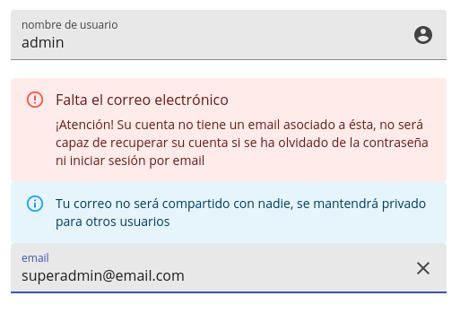

After that you should be asked for your password since the user has a policy that in order to update the email it requires password confirmation in the schema.

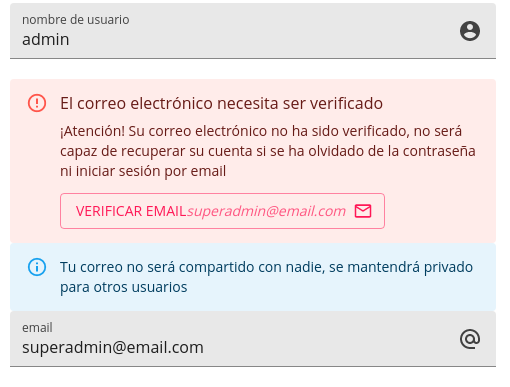

Click the button and you should get something such as:

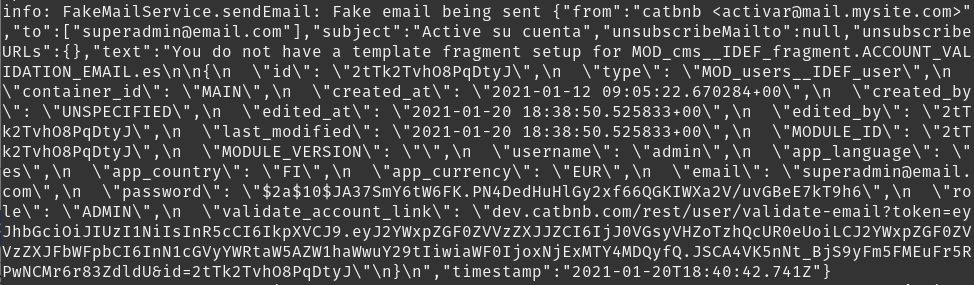

This is your fake email that is being sent, and that JSON that is double stringified contains the email, right now it says that there is no template set so it just sends the entire raw JSON of the available properties, this is a security hole in production builds, but we are currently building our application, one of these properties is `validate_account_link` pick it and set it up to be in localhost where you are working.

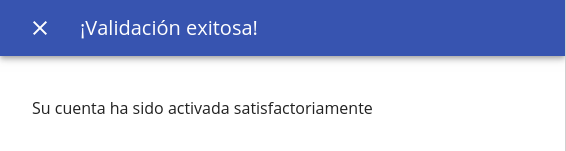

And that should give you an email success verification message, now if you go back to the user we were trying to host from and make a new reservation request.

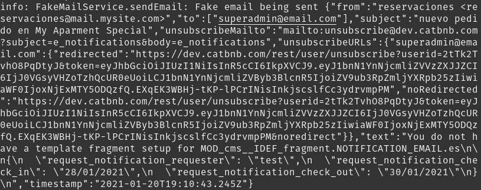

You can now see the fake email, and everything formatted to the language of the user; however equally, it complains of having no template and just sends the raw json data for it, which is not optimal.

## Making a template fragment ready

We want to get a fragment ready for this template so that when we get a designer on board they can actually make a template out of it, we have id `NOTIFICATION_EMAIL` which takes `request_notification_requester`, `request_notification_check_in` and `request_notification_check_out` as parameters so that we actually send something for that we want to go onto our CMS.

We want to go to the file `src/client/pages/cms/fragment` and add to the known fragments list a new fragment.

```tsx
{
    "NOTIFICATION_EMAIL": {
        type: "context",
        label: "Request notification email",
        properties: {
            request_notification_requester: {
                type: "text",
                label: "Requester",
            },
            request_notification_check_in: {
                type: "text",
                label: "Check in time",
            },
            request_notification_check_out: {
                type: "text",
                label: "Check out time",
            },
        },
    },
}
```

Now try to rebuild with esbuild dev and refresh the site on your admin user and check out the CMS.

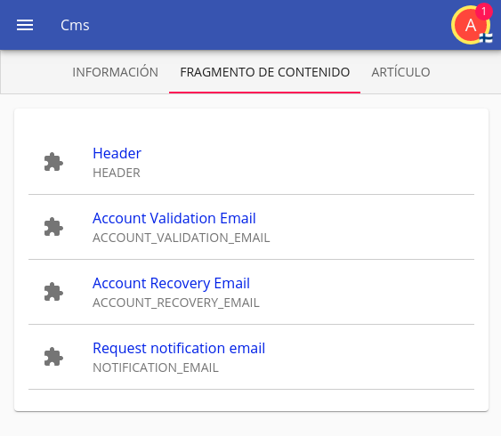

Click on it and you will now be in the rich text editor edition view, you might notice the following attributes of the CMS regarding fragments.

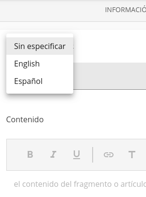

This allows you to choose the language, however keep in mind that you always need to have the standard fragment

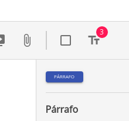

Note how there are 3 elements in the badge, this refers to the templating attributes that can be inserted, now let's try to make a very basic template with an unspecified language (the fallback).

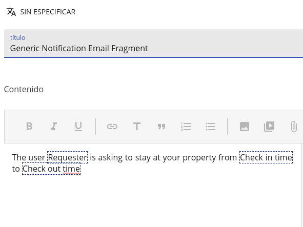

Now after saving attempt a request again and check out the difference in the message that is being sent that is now based on the template

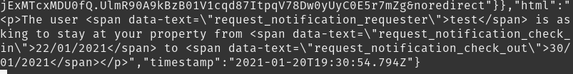

And now that the fallback generic has been created it's possible to create one for Spanish, English, etc...

Fragments are incredibly powerful, they are under the hood simply HTML content that can be templatized, not only they are able to specify rich text for external templates, but can also be used and loaded in page; and because they are an itemize element like anything else, it also holds the same realtime capabilities; we will explore that in depth later on.

Anything shown in these CMS views can be modified, the rich text editor that allows all these modifications is nothing but the renderer for a text type; you can write your own custom renderer with your own editor type, this means you can customize to the fullest what you are able to do; eg. if you want to have math, or other interactive items load; everything, in realtime and with offline support.

## Securing the status of the request

You might notice that the request it is absolutely possible for the `OWNER_OF_UNIT` to be able to change the value of `APPROVED` to `DENIED` and we don't want that to happen, they are only allowed to change from `WAIT` to the other two statuses.

This is however complex logic, nothing that the schema can itself handle; for that we want to go back to our triggers, the one we have created, and we want something as:

```ts
// before an edition has happened
if (arg.action === IOTriggerActions.EDIT) {
    // if the status is being updated
    if (
        arg.requestedUpdate.status &&
        arg.originalValue.status !== "WAIT"
    ) {
        arg.forbid("You cannot change the status once it has been approved or denied");
    }
}
```

And as such we have forbidden this from occurring.

## Creating a screen to view my requests and their status

You have noticed that the page just clears up and the url changes when you have just created a reservation, we want to change that and actually view the reservation when you have created them, as well as to have a screen for viewing the requests you have made.

On the same reserve page we want to refactor our `reserve/index.tsx` a little bit so that it can also display existing reservation requests like this

```tsx
import React from "react";

import { ModuleProvider } from "@onzag/itemize/client/providers/module";
import { IActionSubmitResponse, ItemProvider } from "@onzag/itemize/client/providers/item";
import TitleSetter from "@onzag/itemize/client/components/util/TitleSetter";
import Entry from "@onzag/itemize/client/components/property/Entry";
import View from "@onzag/itemize/client/components/property/View";
import { SubmitButton } from "@onzag/itemize/client/fast-prototyping/components/buttons";
import SubmitActioner from "@onzag/itemize/client/components/item/SubmitActioner";
import Snackbar from "@onzag/itemize/client/fast-prototyping/components/snackbar";
import Reader, { TextReader } from "@onzag/itemize/client/components/property/Reader";
import Typography from "@mui/material/Typography";

interface IReserveHostingProps {
    match: {
        params: {
            id: string;
            rid: string;
        };
    };
}

/**
 * Page to add or edit a hosting unit
 */
export function ReserveHosting(props: IReserveHostingProps) {
    const idToReserve = props.match.params.id || null;
    const reservationId = props.match.params.rid || null;
    const newRequestRedirectCallback = (data: IActionSubmitResponse) => `/reserve/${idToReserve}/request/${data.id}`;
    return (
        <ModuleProvider module="hosting">
            <ItemProvider
                itemDefinition="unit"
                // we are adding the id here that we plan to load
                // the null slot is the same as not specified
                forId={idToReserve}
                // these are the properties that
                // we have a state for
                properties={[
                    "title",
                    "description",
                    "attachments",
                    "image",
                    "address",
                    "unit_type",
                ]}
            >
                {/* we will use the title property and read it raw and use such
                property value as the title value for the window */}
                <TextReader id="title">
                    {(title) => (
                        <TitleSetter>
                            {title && title.value}
                        </TitleSetter>
                    )}
                </TextReader>
                <Typography variant="caption">
                    <View id="unit_type" />
                </Typography>
                <Typography variant="h2">
                    <View id="title" />
                </Typography>
                <View id="description" />
                <View id="image" />
                <View id="address" />
            </ItemProvider>

            <hr />

            <ItemProvider
                itemDefinition="request"
                properties={[
                    "message",
                    "check_in",
                    "check_out",
                    "status",
                ]}
                forId={reservationId}
            >
                {
                    reservationId ?
                        <Typography variant="h3">
                            <View id="status" />
                        </Typography>
                        : null
                }
                {
                    reservationId ? <View id="message" /> : <Entry id="message" />
                }
                {
                    reservationId ? <View id="check_in" /> : <Entry id="check_in" />
                }
                {
                    reservationId ? <View id="check_out" /> : <Entry id="check_out" />
                }

                {
                    !reservationId ?
                        <>
                            <SubmitButton
                                i18nId="request"
                                buttonColor="primary"
                                buttonVariant="contained"
                                options={{
                                    properties: [
                                        "message",
                                        "check_in",
                                        "check_out",
                                    ],
                                    restoreStateOnSuccess: true,
                                    parentedBy: {
                                        item: "hosting/unit",
                                        id: idToReserve,
                                    }
                                }}
                                redirectOnSuccess={newRequestRedirectCallback}
                                redirectReplace={true}
                            />
                            <SubmitActioner>
                                {(actioner) => (
                                    <Snackbar
                                        id="request-error"
                                        severity="error"
                                        i18nDisplay={actioner.submitError}
                                        open={!!actioner.submitError}
                                        onClose={actioner.dismissError}
                                    />
                                )}
                            </SubmitActioner>
                        </> :
                        null
                }
            </ItemProvider>
        </ModuleProvider>
    );
}
```

Then you need to add the snippet to the `app.tsx` in order to ensure the routes are setup properly.

```tsx
<Route path="/reserve/:id" component={ReserveHosting} exact={true}/>
<Route path="/reserve/:id/request/:rid" component={ReserveHosting} exact={true}/>
```

And once you have made a booking it should look as

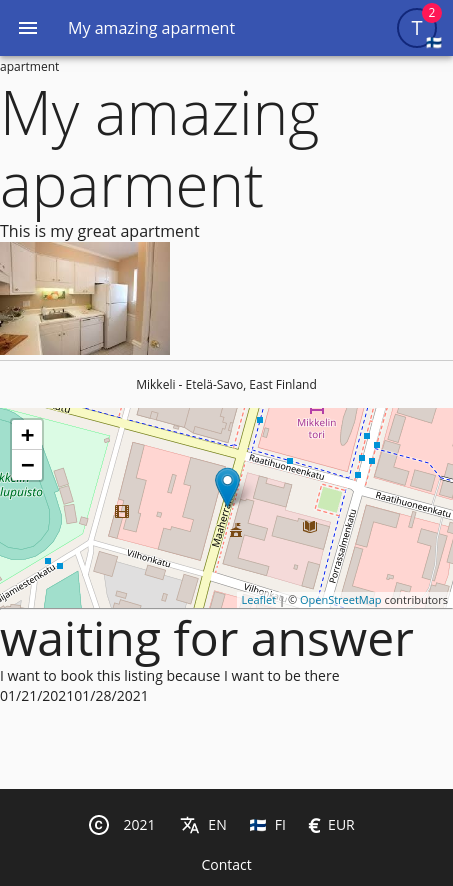

The next thing to do is that we want to show a list since while this shows on creation we also need to be able to display the same thing as all the requests that a potential client has done, and for that we will need a new menu entry to the list at `app.tsx`

```tsx
{
    path: "/reservations",
    icon: <EventSeatIcon />,
    module: "hosting",
    idef: "request",
    i18nProps: {
      id: "view_reservations",
      capitalize: true,
    },
    roles: ["USER", "ADMIN"],
}
```

Now what we want to ensure is to have the `view_reservations` in our properties file for the request schema.

```properties
custom.view_reservations = view reservations
```

```properties
custom.view_reservations = ver reservaciones
```

And now we should have a menu entry added, remember to run `build-data` and `esbuild-dev`

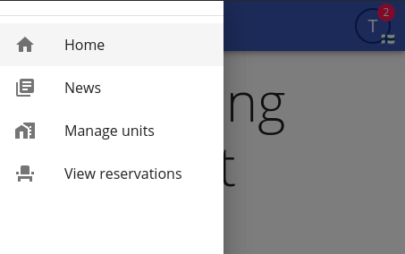

If we click on it, again we will go to an empty page; now we need to add information into that empty page in order to show the list of the requests we have made, for that we create a new page at `pages/reservations/index.tsx` where we will populate with the following:

```tsx
import React from "react";

import { ModuleProvider } from "@onzag/itemize/client/providers/module";
import { ItemProvider } from "@onzag/itemize/client/providers/item";
import TitleSetter from "@onzag/itemize/client/components/util/TitleSetter";
import View from "@onzag/itemize/client/components/property/View";
import Entry from "@onzag/itemize/client/components/property/Entry";
import I18nRead from "@onzag/itemize/client/components/localization/I18nRead";
import UserDataRetriever from "@onzag/itemize/client/components/user/UserDataRetriever";
import { SearchLoaderWithPagination } from "@onzag/itemize/client/fast-prototyping/components/search-loader-with-pagination";
import Reader from "@onzag/itemize/client/components/property/Reader";
import Link from "@onzag/itemize/client/components/navigation/Link";

import List from "@mui/material/List";
import Typography from "@mui/material/Typography";
import ListItem from "@mui/material/ListItem";
import ListItemText from "@mui/material/ListItemText";
import Box from "@mui/material/Box";

/**
 * Some styles for the list of units
 */
const hostingStyles = {
    image: {
        width: "30%",
        display: "inline-block",
    },
    listingText: {
        padding: "0 1rem",
    },
    listing: {
        "transition": "background-color 0.3s",
        "cursor": "pointer",
        "&:hover": {
            backgroundColor: "#eee",
        },
    },
    paginator: {
        paddingTop: "1rem",
        display: "flex",
        alignItems: "center",
        justifyContent: "center",
    },
};

/**
 * Page to add or edit a hosting unit
 */
export function Reservations() {
    return (
        <ModuleProvider module="hosting">
            <UserDataRetriever>
                {(userData) => (
                    <ItemProvider
                        itemDefinition="request"
                        searchCounterpart={true}
                        properties={[
                            "status"
                        ]}
                        // we want our automatic search to be instant
                        // the reason is that automatic searches when they are
                        // refreshing would stack searches and only choose the last
                        // one, this is to prevent search fields to send a new search
                        // request on every keystroke, but our status is a select
                        // not a entry where you type, so instant results are preferred
                        // and make the app feel more snappy
                        automaticSearchInstant={true}
                        automaticSearch={{
                            limit: 100,
                            offset: 0,
                            requestedProperties: [
                                "status",
                                "check_in",
                                "check_out",
                            ],
                            searchByProperties: [
                                "status",
                            ],
                            createdBy: userData.id,
                        }}
                        cleanOnDismount={{
                            cleanSearchResultsOnAny: true,
                        }}
                    >
                        <I18nRead id="view_reservations">
                            {(i18nViewReservations: string) => (
                                <TitleSetter>
                                    {i18nViewReservations}
                                </TitleSetter>
                            )}
                        </I18nRead>

                        <Entry id="status" searchVariant="search"/>

                        <List>
                            <SearchLoaderWithPagination id="reservation-search-loader" pageSize={12}>
                                {(arg, pagination, noResults) => (
                                    <>
                                        {
                                            arg.searchRecords.map((r) => (
                                                <ItemProvider {...r.providerProps}>
                                                    <Reader id="parent_id">
                                                        {(parentId: string) => (
                                                            <Link to={`/reserve/${parentId}/request/${r.id}`}>
                                                                <Typography variant="body1">
                                                                    <View id="status" />
                                                                </Typography>
                                                                <Typography variant="caption" color="textSecondary">
                                                                    <View id="check_in" />{" "}<View id="check_out" />
                                                                </Typography>
                                                                <ListItem sx={hostingStyles.listing}>
                                                                    <ItemProvider
                                                                        itemDefinition="unit"
                                                                        forId={parentId}
                                                                        properties={[
                                                                            "image",
                                                                            "title",
                                                                            "address",
                                                                        ]}
                                                                    >
                                                                        <View
                                                                            id="image"
                                                                            rendererArgs={
                                                                                {
                                                                                    useFullImage: true,
                                                                                    // we do not want to link images with with <a> tags like
                                                                                    // the active renderer does by default
                                                                                    disableImageLinking: true,
                                                                                    imageSizes: "30vw",
                                                                                    imageSx: hostingStyles.image,
                                                                                }
                                                                            }
                                                                        />
                                                                        <ListItemText
                                                                            sx={hostingStyles.listingText}
                                                                            primary={<View id="title" />}
                                                                            secondary={<View id="address" rendererArgs={{ hideMap: true }} />}
                                                                        />
                                                                    </ItemProvider>
                                                                </ListItem>
                                                            </Link>
                                                        )}
                                                    </Reader>
                                                </ItemProvider>
                                            ))
                                        }
                                        <Box sx={hostingStyles.paginator}>
                                            {pagination}
                                        </Box>
                                    </>
                                )}
                            </SearchLoaderWithPagination>
                        </List>
                    </ItemProvider>
                )}
            </UserDataRetriever>
        </ModuleProvider >
    );
}
```

And add the respective route entry to the `app.tsx`

```tsx
<Route path="/reservations" component={Reservations}/>
```

The result should be the following view

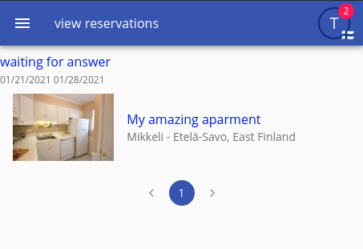

Yes it is a very rudimentary view, but it gets the job done and it is rather simplistic on what it tries to achieve

## Creating a screen to view reservations and requests (and approving/denying them)

You might notice that the request cannot yet be approved by the host, and we need to create a screen for the host in order to be able to approve the incoming requests (or deny them).

We want to display that in the hosting view as well as the user view so we want to build some counters for this, on the `user.json` schema and on the `unit.json` schema, we want to add a new property, on both of them:

```json
{
    "id": "pending_requests_count",
    "type": "integer",
    "default": 0,
    "nullable": true,
    "hidden": true,
    "readRoleAccess": ["&OWNER"],
    "createRoleAccess": [],
    "editRoleAccess": [],
    "coerceNullsIntoDefaultAfterSubmit": true
}
```

Now you run `npm run build-data` and `npm run build-database development` when asked about the default value for the new column, give `0` as the default value, to ensure that it is not null to start with.

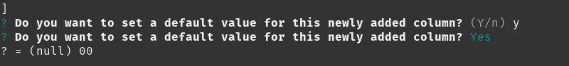

Now we have a new number property in our users as well as in our units, in itemize it's considered best that if you need to access data that is calculated you can just create a hidden property and keep such updated by the means of triggers; this ensures that you don't have to eg. run an entire search in the client side. With this method you can create counters of any kind.

Now let's start by setting up the triggers regarding this field, first in our CREATED trigger that sent the email, under it we add:

```tsx
// we are going to do a raw database update, even if we have hostingUnit already
// and we can calculate what the +1 value will be for the counter using hostingUnit.pending_requests_count
// and we could use requestUpdateSimple in order to update this value we want to do it this way
// to show it's possible to do raw updates to the database, also a raw update disables race conditions
// while a +1 mechanism can not be optimal your query can be as complex as necessary in order to avoid
// race conditions
await arg.appData.rawDB.performRawDBUpdate(
    "hosting/unit",
    hostingUnit.id,
    hostingUnit.version,
    {
        itemTableUpdate: {
            // this for example could be changed with a subquery to a count
            // but we are just going to leave it like this
            // a count itself would be better for consistency
            // but this is just for a tutorial
            pending_requests_count: [`"pending_requests_count" + 1`, []],
        }
    }
);
await arg.appData.rawDB.performRawDBUpdate(
    "users/user",
    targetUser.id,
    targetUser.version,
    {
        itemTableUpdate: {
            pending_requests_count: [`"pending_requests_count" + 1`, []],
        }
    }
);
```

This is however a demonstration of the capacity of itemize to modify raw rows in place, we could do a simple update via the cache, which is usually one of the best ways to update, however, we want to be paranoid, and think of race conditions, so we want the update to occur at database level and get the result of the update back.

Using rawDB instead of database connection, ensures that our changes get published into all the caches.

Now we have added the trigger that increases the counter once a new request has been created, but now we want a trigger that decreases once a request has been answered.

We will need an entire condition on EDITED:

```tsx
if (
    arg.action === IOTriggerActions.EDITED &&
    arg.originalValue.status === "WAIT" &&
    arg.newValue.status !== "WAIT"
) {
    // yes we can grab the updated value from here, while you might wonder
    // why is itemize fetching the entire thing, well, in order to update
    // the caches.
    const hostingUnit = await arg.appData.rawDB.performRawDBUpdate(
        "hosting/unit",
        arg.newValue.parent_id as string,
        arg.newValue.parent_version as string,
        {
            itemTableUpdate: {
                pending_requests_count: [`"pending_requests_count" - 1`, []],
            }
        }
    );

    // so we can use the creator on a new raw database update
    await arg.appData.rawDB.performRawDBUpdate(
        "users/user",
        hostingUnit.created_by,
        null,
        {
            itemTableUpdate: {
                pending_requests_count: [`"pending_requests_count" - 1`, []],
            }
        }
    );
}
```

Now we want to be able to see such counter, note that if you have created any requests previous to this, the counter will not keep such in consideration, other than what they change, this means that it might get to -1 when we answer those requests, this is why it might have been a better idea to use a subquery and count every time, but right now, for the motives of this tutorial we will let it be as a simple counter, it's also more resilliant that way.

So we want to display this counter, on the fast prototyping navbar there's a property on menu entries called badge content, we can use that to display something in it.

We will take our hosting menu entry and update it to:

```tsx
{
    path: "/hosting",
    icon: <HomeWorkIcon />,
    badgeContent: (
      <UserDataRetriever>
        {(userData) => (
          <ModuleProvider module="users">
            <ItemProvider
              itemDefinition="user"
              forId={userData.id}
              properties={[
                "pending_requests_count"
              ]}
            >
              <Reader id="pending_requests_count">{(value: number) => (value || 0)}</Reader>
            </ItemProvider>
          </ModuleProvider>
        )}
      </UserDataRetriever>
    ),
    module: "hosting",
    idef: "unit",
    i18nProps: {
      id: "manage",
      capitalize: true,
    },
    roles: ["USER", "ADMIN"],
}
```

After we have done all this lets test our changes, by running `npm run install` and `npm run esbuild-dev`, restarting then the server, and refreshing our page, we might then find this view in our menu:

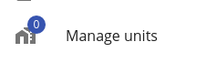

We will now use our second user and make a new request, make many, and then you will see that the number is updating in real time.

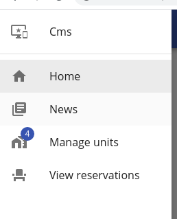

Now we want to be able to see the same thing but in our hosting view itself, for that we need to add `pending_requests_count` to the `requestedProperties` in the automatic search at `hosting/index.tsx` in the component for `UnitList`:

```tsx
[
    "title",
    "address",
    "image",
    "pending_requests_count",
]
```

And then replace the rendering function of each item that is in the list with the following code:

```tsx
<ItemProvider {...r.providerProps}>
    <Reader id="pending_requests_count">
        {(count: number) => (
            <Badge color="primary" badgeContent={count || 0}>
                <Link to={`/hosting/view/${r.id}`}>
                    <ListItem sx={unitListStyles.listing}>
                        <View
                            id="image"
                            rendererArgs={
                                {
                                    useFullImage: true,
                                    // we do not want to link images with with <a> tags like
                                    // the active renderer does by default
                                    disableImageLinking: true,
                                    // we want the image size to load by 30 viewport width
                                    // this is used to choose what image resolution to load
                                    // so they load faster, we want tiny images
                                    imageSizes: "30vw",
                                    imageSx: unitListStyles.image,
                                }
                            }
                        />
                        <ListItemText
                            sx={unitListStyles.listingText}
                            primary={<View id="title" />}
                            secondary={<View id="address" rendererArgs={{ hideMap: true }} />}
                        />
                    </ListItem>
                </Link>
            </Badge>
        )}
    </Reader>
</ItemProvider>
```

You should be able to see now your list including the list of requests pending that there are:

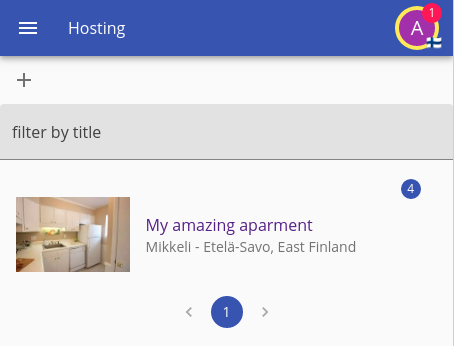

We have changed the default behaviour of where the page takes us, now it doesn't take us to the edit area, but rather to a view point that currently displays nothing.

## Creating the view with the listing and its requests

We want to now create a page for viewing the listing itself and the requests that are involved into it and we will do that in the same view that shows our item, for that we will add a new function into our `hosting/index.tsx` page, for the sake of this tutorial and just to show the capabilities you are dealing with, we will make the results that are displayed be realtime, using a listening policy.

```tsx
/**
 * Some styles for the list of units
 */
const viewHostingStyles = {
    listingText: {
        padding: "0 1rem",
    },
    listing: {
        "transition": "background-color 0.3s",
        "cursor": "pointer",
        "&:hover": {
            backgroundColor: "#eee",
        },
    },
};

interface IViewHostingProps {
    match: {
        params: {
            id: string;
        };
    };
}

export function ViewHosting(props: IViewHostingProps) {
    const idToView = props.match.params.id || null;

    return (
        <ItemProvider
            itemDefinition="unit"
            forId={idToView}
            properties={[
                "title",
                "image",
                "unit_type",
            ]}
        >
            <Link to={`/hosting/edit/${idToView}`}>
                <IconButton>
                    <EditIcon />
                </IconButton>
            </Link>

            <View id="unit_type" />
            <View id="title" />
            <View id="image" />

            <hr />

            <ItemProvider
                itemDefinition="request"
                searchCounterpart={true}
                properties={[
                    "status"
                ]}
                automaticSearchInstant={true}
                automaticSearch={{
                    // on a traditional search by default the max amount
                    // of records you can pull is limited to 50, this can
                    // be changed but 50 will do right now
                    limit: 50,
                    offset: 0,
                    requestedProperties: [
                        "check_in",
                        "check_out",
                    ],
                    searchByProperties: [
                        "status",
                    ],
                    parentedBy: {
                        id: props.match.params.id,
                        version: null,
                        item: "hosting/unit"
                    },
                    // we are performing a traditional search,
                    // normally when itemize does a search it request
                    // a list of records and then requests each page
                    // one by one, this is good if you wish to only download
                    // what is necessary while keeping the search state to that
                    // point in time, however we will display all the results
                    // so we need all the data, in this case, it will be cheaper
                    // to use a traditional search
                    traditional: true,

                    // we will aso just for demonstration use a by parent listen policy
                    // which means that the search will be realtime as well, a traditional
                    // by parent search is expensive, and normally you wouldn't do that, you
                    // would want a standard search with a cachePolicy as well; anyway a by parent listen policy will update
                    // via the parent context, every time the parent gets added, deleted or modified a child
                    // the search considers itself obsolete, because it is a traditional search
                    // it has no other way to update other than by calling the server again
                    // if we had a cache policy it would actually figure out the difference and only
                    // request the new records, but we will study that on the optimization/offline sections
                    listenPolicy: "by-parent",
                }}
                cleanOnDismount={{
                    cleanStateOnAny: true,
                }}
            >
                <Entry id="status" searchVariant="search" />

                <List>
                    {/**
                 * Note how we use the standard search loader rather than a paged search loader
                 * this one is standard and not fast prototyping and it is what the paged loader
                 * is built upon, it also uses pages, but it has no pagination element built in
                 * because we are anyway displaying the entire thing, we will just use a page the exact
                 * size of our limit
                 */}
                    <SearchLoader
                        pageSize={50}
                        currentPage={0}

                        // we are making the search results be static and do not bind to listen for changes
                        // you might wonder how is this compatible with the listen realtime policy well this is because
                        // we are telling "individual" results not to update; the search loader keeps results up
                        // to date by itself because it listens to changes of the records as we have a listen policy
                        // so we should always use TOTAL when we are listening otherwise you are wasting memory cycles
                        static="TOTAL"
                    >
                        {(arg) => (
                            arg.searchRecords.map((r) => (
                                <ItemProvider {...r.providerProps}>
                                    <Link to={`/hosting/view/${idToView}/request/${r.id}`}>
                                        <ListItem sx={viewHostingStyles.listing}>

                                            {/**
                                              * We will read the creator of this record
                                              */}
                                            <Reader id="created_by">
                                                {(createdBy: string) => (
                                                    // and now we will render the item
                                                    <ListItemText
                                                        sx={viewHostingStyles.listingText}
                                                        primary={
                                                            <ModuleProvider
                                                                module="users"
                                                            >
                                                                <ItemProvider
                                                                    itemDefinition="user"
                                                                    properties={[
                                                                        "username"
                                                                    ]}
                                                                    // wait and merge basically means collect as many of these as possible
                                                                    // and request them all at once, this will prevent having to do a round
                                                                    // trip per user, as the server is able to process many requests
                                                                    // at once, it also ensures that if the user is the exact same, then no
                                                                    // new request will be made and they'll use the same value, wait and merge
                                                                    // is quite effective to reducing network requests, but it comes at a cost
                                                                    // 70 ms of delay during collection
                                                                    waitAndMerge={true}
                                                                    forId={createdBy}
                                                                >
                                                                    <View id="username" />
                                                                </ItemProvider>
                                                            </ModuleProvider>
                                                        }
                                                        secondary={
                                                            <span>
                                                                <View id="check_in" /><span>{" - "}</span><View id="check_out" />
                                                            </span>
                                                        }
                                                    />
                                                )}
                                            </Reader>
                                        </ListItem>
                                    </Link>
                                </ItemProvider>
                            ))
                        )}
                    </SearchLoader>
                </List>
            </ItemProvider>
        </ItemProvider>
    );
}
```

And we should then register it into the router itself at the `Hosting` component

```tsx
<Route
    path="/hosting/view/:id"
    exact={true}
    component={ViewHosting}
/>
```

Now if we go to the view screen, we should see something as:

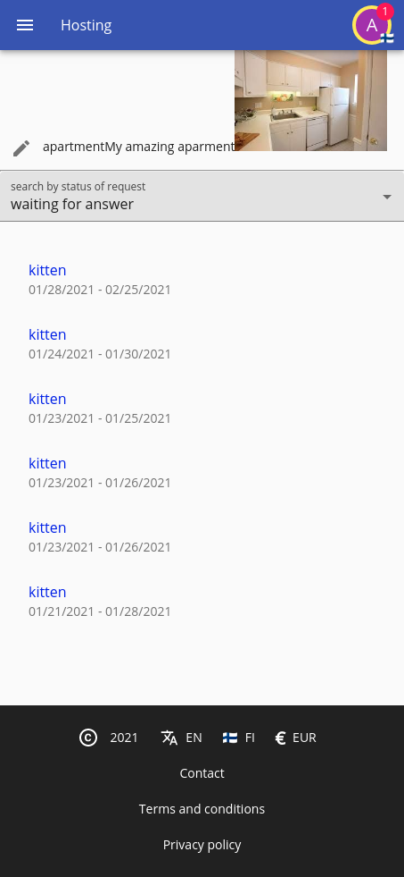

And if you change any element of what is currently displayed there, you will realize that it is kept up to date, you might try for example to make a new request for hosting, and it will appear on the list, in realtime, because we have a listening policy.

Even doing things like changing the name of the user will work, not because of the listening policy but rather because of the item loader, also since we have used wait and merge, it ensures that only one request takes place to load and reload the user, or as many as there can be, wait and merge is a very powerful capability of itemize, which allows to collect as many requests as possible before sending them together into one batch for the server to process.

Now we need to see these requests and approve/deny them, in the same hosting page let's add the following functionality.

```tsx
import { Avatar } from "../../components/avatar";

interface IApproveDenyRequestProps {
    match: {
        params: {
            id: string;
            rid: string;
        };
    };
}

export function ApproveDenyRequest(props: IApproveDenyRequestProps) {
    const unitId = props.match.params.id;
    const requestId = props.match.params.rid;

    return (
        <ItemProvider
            itemDefinition="unit"
            forId={unitId}
            properties={[
                "title",
                "image",
                "unit_type",
            ]}
        >
            <View id="unit_type" />
            <View id="title" />
            <View id="image" />

            <hr />

            <ItemProvider
                itemDefinition="request"
                forId={requestId}
                properties={[
                    "message",
                    "check_in",
                    "check_out",
                    "status",
                ]}
            >
                <Reader id="created_by">
                    {(createdBy: string) => (
                        <ModuleProvider
                            module="users"
                        >
                            <ItemProvider
                                itemDefinition="user"
                                properties={[
                                    "username",
                                    "profile_picture",
                                    "app_country",
                                    "role",
                                ]}
                                forId={createdBy}
                            >
                                <Avatar size="large" hideFlag={true} fullWidth={true} />
                                <View id="username" />
                            </ItemProvider>
                        </ModuleProvider>
                    )}
                </Reader>

                <View id="message" />
                <View id="check_in" />
                <View id="check_out" />
                <View id="status" />

                <Reader id="status">
                    {(status: string) => {
                        if (status === "WAIT") {
                            return (
                                <>
                                    <hr />
                                    <SubmitButton
                                        i18nId="approve"
                                        options={{
                                            properties: [
                                                "status",
                                            ],
                                            unpokeAfterSuccess: true,
                                            propertyOverrides: [{
                                                id: "status",
                                                value: "APPROVED",
                                            }],
                                        }}
                                        buttonVariant="contained"
                                        buttonColor="primary"
                                        buttonStartIcon={<DoneOutlineIcon />}
                                    />
                                    <SubmitButton
                                        i18nId="deny"
                                        options={{
                                            properties: [
                                                "status",
                                            ],
                                            unpokeAfterSuccess: true,
                                            propertyOverrides: [{
                                                id: "status",
                                                value: "DENIED",
                                            }],
                                        }}
                                        buttonVariant="contained"
                                        buttonColor="secondary"
                                        buttonStartIcon={<DoneOutlineIcon />}
                                    />
                                </>
                            );
                        }
                        return null;
                    }}
                </Reader>

                <SubmitActioner>
                    {(actioner) => (
                        <>
                            <Snackbar
                                id="request-update-error"
                                severity="error"
                                i18nDisplay={actioner.submitError}
                                open={!!actioner.submitError}
                                onClose={actioner.dismissError}
                            />
                            <Snackbar
                                id="request-update-success"
                                severity="success"
                                i18nDisplay="change_success"
                                open={actioner.submitted}
                                onClose={actioner.dismissSubmitted}
                            />
                        </>
                    )}
                </SubmitActioner>
            </ItemProvider>
        </ItemProvider>
    );
}
```

And let's add it to our router.

```tsx
<Route
    path="/hosting/view/:id/request/:rid"
    exact={true}
    component={ApproveDenyRequest}
/>
```

Now we would need to add the missing language fields at `request.properties`

```properties
custom.approve = approve request
custom.deny = deny request
custom.change_success = status change succesful
```

And in spanish

```properties
custom.approve = aprovar pedido
custom.deny = denegar pedido
custom.change_success = cambio de estado exitoso
```

We got to run `npm run build-data` due to the changes in the schema and `npm run esbuild-dev` to update our app, now we should be able to see the following screen when we are checking a single request.

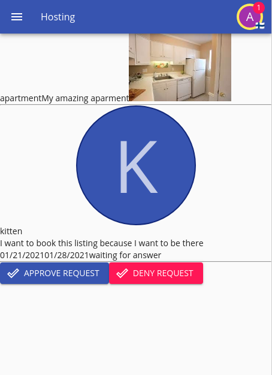

Now we can use the buttons to change the status, however in some certain scenarios, say if you made a request and you approve it after the today's date, as in you approve the request when the date has ellapsed and it has begun already to be timed we can get this error:

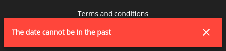

But what is going on here? why is the server complaining of a date being in the past when we clearly aren't changing the date, well, when you edit an item, itemize will check the entire item for the change; and the rule we have is that our day cannot be in the past, but we want that functionality, so what do we do now?...

We are going to use a server flag for this to specify that a condition is only to be checked during the creation time, and not during the edition, let's go back to our schema and add a server flag right into the condition.

```json
{
    "if": {
            "property": "&this",
            "comparator": "less-than",
            "value": {
            "exactValue": "today"
        },
        "method": "date",
        "serverFlag": "CREATE_ONLY"
    },
    "error": "DATE_IS_IN_THE_PAST"
}
```

The values for the server flags are `CREATE_ONLY`, `EDIT_ONLY` and `SEARCH_ONLY`, we could also add the create only into the check_out as well, note that these server flags do not affect the client side.

Now if you run `npm run build-data` and restart the server it should work just fine as the considerations of the rule have changed.

## Ensuring non-overlapping requests and responses

Something we also don't want is that when a request is being created that it is going to be created on top of previous existing requests that have been approved, as this will just burden the host with a bunch of requests that he/she might be unable to approve because someone is already coming that same day, so we want to ensure this doesn't happen.

For this we will go back to our trigger and this time we will need to access the database directly and write a new rule in our request:

```ts
// this will trigger before creating when
// the endpoint is attempting to create a new item
if (arg.action === IOTriggerActions.CREATE) {
    const checkIn: string = arg.requestedUpdate.check_in as string;
    const checkOut: string = arg.requestedUpdate.check_out as string;
    const overlappingRequests = await arg.appData.rawDB.performRawDBSelect(
        "hosting/request",
        (selecter) => {
            selecter.select("id").limit(1);
            // and we are going to search for an overlap between check in and check out
            selecter.whereBuilder.andWhereColumn("status", "APPROVED");
            selecter.whereBuilder.andWhere((clause) => {
                clause.orWhere((subclause) => {
                    subclause.andWhereColumn("check_in", "<=", checkIn).andWhereColumn("check_out", ">", checkIn);
                }).orWhere((subclause) => {
                    subclause.andWhereColumn("check_in", "<", checkOut).andWhereColumn("check_out", ">=", checkOut);
                }).orWhere((subclause) => {
                    subclause.andWhereColumn("check_in", ">=", checkIn).andWhereColumn("check_out", "<=", checkOut);
                });
            });
            selecter.whereBuilder.andWhereColumn("parent_id", arg.requestedUpdate.parent_id as string);
        }
    );

    if (overlappingRequests.length) {
        // we put the id in the error message, the user doesn't see forbidden messages anyway
        // but it's good for debugging
        arg.forbid(
            "This request is overlapping with an approved request " + overlappingRequests[0].id,
            "OVERLAPPING_REQUEST",
        );
    }
}
```

We have just forbidden with a custom error code, as such we need to add such error code to our list, we add it to the `root.properties` file that determines the root base language data, and set a new message for the error.

```properties
error.OVERLAPPING_REQUEST = the date you are trying to request for is already booked for
```

And in spanish

```properties
error.OVERLAPPING_REQUEST = la fecha en la que intenta hacer un pedido ya está reservada
```

Now rebuild, and give it a try after you have approved a request, you should get the error message.

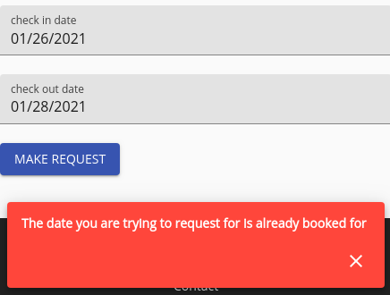

And your custom message should come by as a warning in the console.

With this method we can also prevent a host from accepting requests if these overlap as well, right into our trigger action
for the edition.

```ts
// so when we are updating a request
// into being approved
if (
    arg.requestedUpdate.status &&
    arg.requestedUpdate.status === "APPROVED"
) {
    const checkIn: string = arg.originalValue.check_in as string;
    const checkOut: string = arg.originalValue.check_out as string;

    const overlappingRequests = await arg.appData.rawDB.performRawDBSelect(
        "hosting/request",
        (selecter) => {
            selecter.select("id").limit(1);
            // and we are going to search for an overlap between check in and check out
            selecter.whereBuilder.andWhereColumn("status", "APPROVED");
            selecter.whereBuilder.andWhere((clause) => {
                clause.orWhere((subclause) => {
                    subclause.andWhereColumn("check_in", "<=", checkIn).andWhereColumn("check_out", ">", checkIn);
                }).orWhere((subclause) => {
                    subclause.andWhereColumn("check_in", "<", checkOut).andWhereColumn("check_out", ">=", checkOut);
                }).orWhere((subclause) => {
                    subclause.andWhereColumn("check_in", ">=", checkIn).andWhereColumn("check_out", "<=", checkOut);
                });
            });
            selecter.whereBuilder.andWhereColumn("parent_id", arg.originalValue.parent_id as string);
        }
    );

    if (overlappingRequests.length) {
        arg.forbid(
            "This request is overlapping with an approved request " + overlappingRequests[0].id,
            "OVERLAPPING_REQUEST",
        );
    }
}
```

## Displaying overlaps in the client side

However how would the user know about these requests that already exist? And not get a terrible forbidden message because of trying to request for a reservation at a date where one was already done?

Well we can indeed use the search functionality to request all the possible overlaps and display them in the client side, and while the fast prototyping itemize renderer does not quite support disabling ranges, we can at least just show them in the date pickers.

While you might wonder, doesn't this cause a leak? where we can now see the user id of each requester, well, if you remember our schema, we had set `"ownerReadRoleAccess": ["&OWNER", "OWNER_OF_UNIT"]` which means that none can actually read this information other than the owner itself and the owner of the unit, as a result our user will be the default `UNSPECIFIED` special identifier.

We will use the check out property to search for any request that is approved that is checked out in the future from our today's date.

Take a note that itemize does not have a compounded viewer for date ranges, you would have to create your own, or use another one from a thrid party; technically you could still choose an invalid date range with this method, as we are only disabling the days that can't be picked for check in or check out but we could still take a date range that picks on those dates by covering them in the range; however this is a non issue since our server will catch those when trying to insert.

Update your `reserve/index.tsx` with the following code from the item definition that appears right after the `<hr />`

```tsx
<ItemProvider
    itemDefinition="request"
    properties={[
        "message",
        "check_in",
        "check_out",
        "status",
    ]}
    forId={reservationId}
>
    {
        reservationId ?
            <Typography variant="h3">
                <View id="status" />
            </Typography>
            : null
    }

    {
        reservationId ? <View id="message" /> : <Entry id="message" />
    }

    {
        !reservationId ?
            // We are adding this code in order to be able to search
            // for the date ranges that are already reserved for
            <ItemProvider
                itemDefinition="request"
                searchCounterpart={true}
                setters={[
                    // We search from the checkout date of everything
                    // that check outs since today to the future
                    {
                        id: "check_out",
                        searchVariant: "from",
                        value: getToday(),
                    },
                    // and that of course is approved
                    {
                        id: "status",
                        searchVariant: "search",
                        value: "APPROVED",
                    },
                ]}
                automaticSearch={{
                    // we do an automatic traditional search for 50 results
                    // with the given properties
                    limit: 50,
                    offset: 0,
                    traditional: true,
                    requestedProperties: [
                        "check_in",
                        "check_out"
                    ],
                    searchByProperties: [
                        "check_out",
                        "status",
                    ],
                    parentedBy: {
                        item: "hosting/unit",
                        id: idToReserve,
                    },
                }}
                cleanOnDismount={{
                    cleanSearchResultsOnAny: true,
                }}
            >
                <SearchLoader
                    static="TOTAL"
                    pageSize={50}
                    currentPage={0}
                    cleanOnDismount={true}
                >
                    {(arg) => {
                        // when we load the search results instead of rendering
                        // them like it would be usual, we are going to take advantage
                        // of the traditional search capability to provide results in
                        // the loader itself, and we grab the data from that and set it
                        // in a variable that will be ported
                        const allCheckInsAndOuts = arg.searchRecords.map((r) => {
                            return {
                                checkIn: r.searchResult.DATA && parseDate((r.searchResult.DATA as any).check_in),
                                checkOut: r.searchResult.DATA && parseDate((r.searchResult.DATA as any).check_out),
                            };
                        });

                        // using set var we are able to transfer a variable to any part of the
                        // document, in this case we transfer the data for the date ranges
                        return <SetVar id="all_check_ins_and_outs" value={allCheckInsAndOuts} />;
                    }}
                </SearchLoader>
            </ItemProvider> :
            null
    }

    {
        reservationId ?
            <View id="check_in" /> :
            // and we read it here
            <ReadVar id="all_check_ins_and_outs">
                {(value) => {
                    // so we can build a function to disable the dates
                    const shouldDisableDate = (checkInTheUserWants: moment.Moment) => {
                        return value.some((v: any) => {
                            const checkIn: moment.Moment = v.checkIn;
                            const checkOut: moment.Moment = v.checkOut;

                            return checkInTheUserWants.isSameOrAfter(checkIn) && checkInTheUserWants.isBefore(checkOut);
                        });
                    }

                    // and we pass it as a renderer arg, note that renderer args are specific to the
                    // renderer, itemize default which is the material ui default supports date disabling
                    // so it's a renderer property, that only that renderer supports, if you write your own
                    // custom renderer you might use other args
                    return <Entry id="check_in" rendererArgs={{ shouldDisableDate }} />
                }}
            </ReadVar>
    }
    {
        reservationId ?
            <View id="check_out" /> :
            <ReadVar id="all_check_ins_and_outs">
                {(value) => {
                    const shouldDisableDate = (checkOutTheUserWants: moment.Moment) => {
                        return value.some((v: any) => {
                            const checkIn: moment.Moment = v.checkIn;
                            const checkOut: moment.Moment = v.checkOut;

                            return checkOutTheUserWants.isAfter(checkIn) && checkOutTheUserWants.isSameOrBefore(checkOut);
                        });
                    }
                    return <Entry id="check_out" rendererArgs={{ shouldDisableDate }} />
                }}
            </ReadVar>
    }

    {
        !reservationId ?
            <>
                <SubmitButton
                    i18nId="request"
                    buttonColor="primary"
                    buttonVariant="contained"
                    options={{
                        properties: [
                            "message",
                            "check_in",
                            "check_out",
                        ],
                        restoreStateOnSuccess: true,
                        parentedBy: {
                            item: "hosting/unit",
                            id: idToReserve,
                        }
                    }}
                    redirectOnSuccess={newRequestRedirectCallback}
                    redirectReplace={true}
                />
                <SubmitActioner>
                    {(actioner) => (
                        <Snackbar
                            id="request-error"
                            severity="error"
                            i18nDisplay={actioner.submitError}
                            open={!!actioner.submitError}
                            onClose={actioner.dismissError}
                        />
                    )}
                </SubmitActioner>
            </> :
            null
    }
</ItemProvider>
```

Grab these imports in case they couldn't be automatically figured out:

```
import SearchLoader from "@onzag/itemize/client/components/search/SearchLoader";
import { getToday, parseDate } from "@onzag/itemize/util";
import SetVar from "@onzag/itemize/client/components/util/SetVar";
import ReadVar from "@onzag/itemize/client/components/util/ReadVar";
```

And now after rebuilding and refreshing your view should reflect the approved requests.

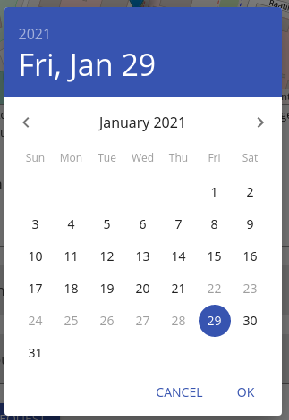

And if you check the user account of the host that owns the property.

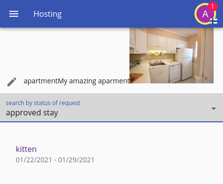

Also notice how the data is not leaking, and our creator who made the request to stay in the property is in fact hidden and we do not know the id of such user.

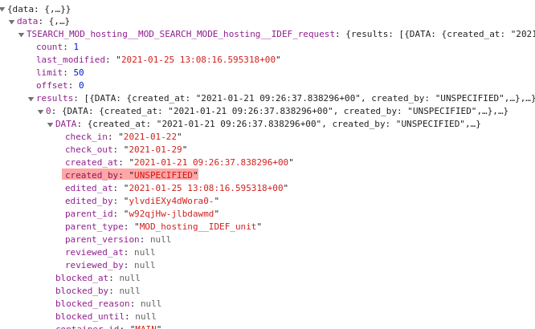

## Send an email notification regarding the approval/denial

Now we want to be able to send a notification to the requester once their request has been approved or denied, change the place where we update the number of notifications for the `EDITED` trigger in our request to reflect this new code where we send an email after the fact

```tsx
if (
    arg.action === IOTriggerActions.EDITED &&
    arg.originalValue.status === "WAIT" &&
    arg.newValue.status !== "WAIT"
) {
    // yes we can grab the updated value from here, while you might wonder
    // why is itemize fetching the entire thing, well, in order to update
    // the caches.
    const hostingUnit = await arg.appData.rawDB.performRawDBUpdate(
        "hosting/unit",
        arg.newValue.parent_id as string,
        arg.newValue.parent_version as string,
        {
            itemTableUpdate: {
                pending_requests_count: [`"pending_requests_count" - 1`, []],
            }
        }
    );

    // so we can use the creator on a new raw database update
    const hostingUser = await arg.appData.rawDB.performRawDBUpdate(
        "users/user",
        hostingUnit.created_by,
        null,
        {
            itemTableUpdate: {
                pending_requests_count: [`"pending_requests_count" - 1`, []],
            }
        }
    );

    const requesterUser = await arg.appData.cache.requestValue(
        "users/user",
        // this is the request, the arg.newValue
        arg.newValue.created_by as string,
        null,
    );

    const requestIdef = arg.appData.root.registry["hosting/request"];
    const i18nData = requestIdef.getI18nDataFor(requesterUser.app_language);

    arg.appData.mailService.sendTemplateEmail({
        // this is the email handle to be sent from [user]@mysite.com
        fromEmailHandle: i18nData.custom.request_notification_email_handle,
        // this is the username that it will be sent as
        fromUsername: i18nData.custom.request_notification_email_username,
        // the subject line
        subject: localeReplacer(
            arg.newValue.status === "APPROVED" ?
                i18nData.custom.request_approved_notification_email_subject :
                i18nData.custom.request_denied_notification_email_subject,
            hostingUnit.title,
        ),
        // whether the user can unsubscribe via email address, allow users
        // to unsubscribe as a norm unless they are very critical emails
        canUnsubscribe: true,
        // where is the subscription state stored, we will reuse the e_notifications
        // boolean that exist within the user, if this boolean is false, the email
        // won't be sent because the user is unsubscribed
        subscribeProperty: "e_notifications",
        // the unsubscription email will be sent, but it will not check if the user
        // is unsubscribed
        ignoreUnsubscribe: false,
        // other important properties in order to send the message, we want to ensure
        // the user is validated and not just spam
        confirmationProperties: ["e_validated"],
        // arguments to render the template
        args: {
            request_notification_host: hostingUser.username,
        },
        // the item definition that we will use as template, we will use a fragment
        itemDefinition: "cms/fragment",
        // the id of the item definition we want to use, this is a custom id
        id: arg.newValue.status === "APPROVED" ? "APPROVAL_EMAIL" : "DENIAL_EMAIL",
        // the version, so we have different versions per language
        version: requesterUser.app_language,
        // the property we want to pull from that item definition
        property: "content",
        // who we are sending to
        to: requesterUser,
    });
}
```

You might notice how we have right now new fragments named `APPROVAL_EMAIL`, `DENIAL_EMAIL` as well as `request_approved_notification_email_subject` and `request_denied_notification_email_subject` are new properties line, so let's first start by adding the fragments at `fragment.tsx`

```tsx
{
    "APPROVAL_EMAIL": {
        type: "context",
        label: "Request approval email",
        properties: {
            request_notification_host: {
                type: "text",
                label: "Host",
            },
        },
    },
    "DENIAL_EMAIL": {
        type: "context",
        label: "Request denial email",
        properties: {
            request_notification_host: {
                type: "text",
                label: "Host",
            },
        },
    },
}
```

And now we do need to add the schema translation lines at `request.properties`

```properties
custom.request_approved_notification_email_subject = reservation approved at {0}
custom.request_denied_notification_email_subject = reservation denied at {0}
```

And in spanish

```properties
custom.request_approved_notification_email_subject = reservación aprobada en {0}
custom.request_denied_notification_email_subject = reservación rechazada en {0}
```

Now after rebuilding the entire thing, and restarting the server you might realize you have a brand new fragment on the CMS, let's make it something meaningful.

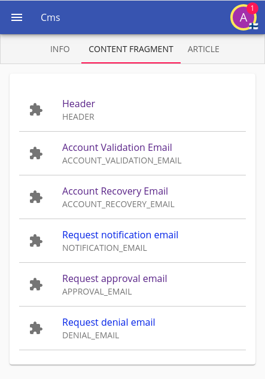

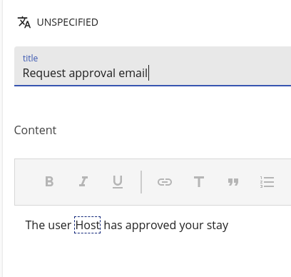

Now let's approve one of those dangling requests, remember that in order for the order to be effective your users must have an email attached to them so that it can be displayed, such email must also be validated.

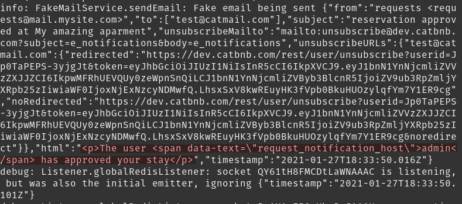

## What you achieved

 1. Allowed users to create requests and defined a request schema.
 2. Defined a custom schema specific role.
 3. Created a page to manage and search our reservations and requests.
 4. Allowed hosts to accept or deny such requests in their own page.
 5. Secured the mechanism and prevented overapping requests from occuring.
 6. Made the the host list be realtime.
 7. Send emails when requesting, and when being accepted/denied a request for the given target in the right language.
 8. Created templates for all these mechanisms a designer can then tackle on.

So we are now ready for managing these reservations in order to be able to put their data into the unit schema to further improve our search mechanism as well as to manage these reservations.

## Next

[Next](./06-reservation.md)
