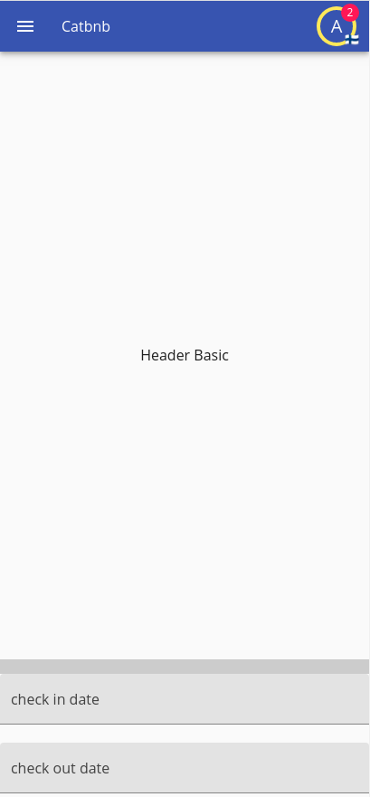
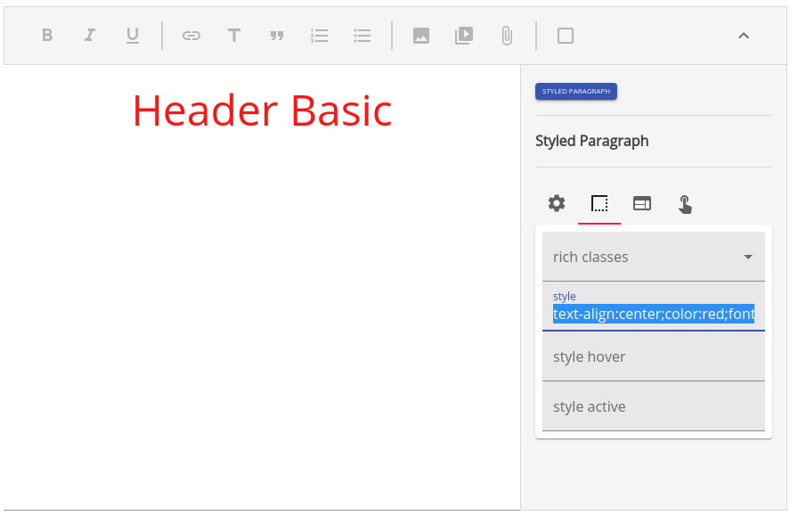
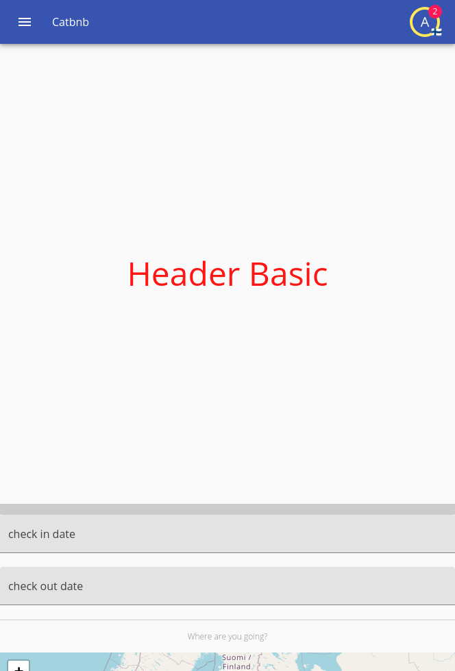
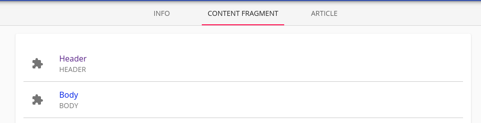
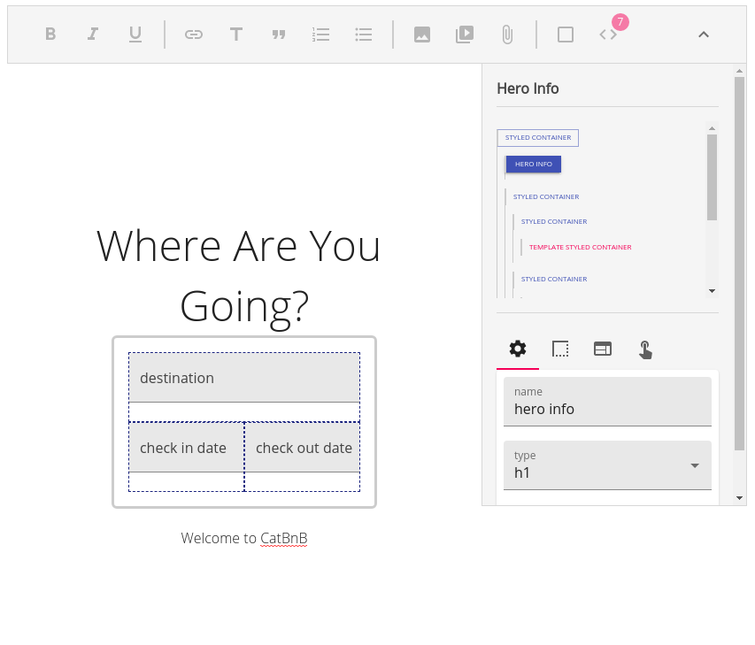
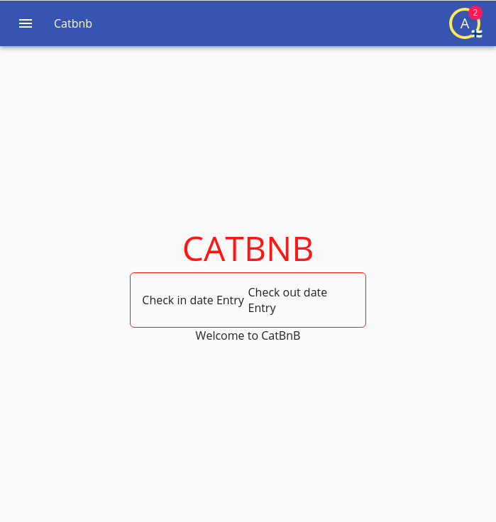

[Prev](./06-reservation.md)

# Redesign

So far our application works, but the UI/UX is absolutely awful; like have you seen what we have done so far? while it is probably good enough for a demonstration and in a prototyping standpoint, it's not good enough regarding the UI structure.

In itemize the UI is attempted to be as separate as possible to the application logic itself by the means of fragments, however not all can be resolved with fragments; primarily our entry renderers that are way too dynamic to be expressed by the means of a fragment template. Even when you could totally write a renderer that uses fragments.

In this section we will write our own custom renderers for several problematic sections; note that you should be able to write a custom renderer in any format you wish, but we will stick to material ui and fast prototyping methods, after all this is a tutorial.

## Story Time

You have shown your application to some prospect investors and it shows to have some potential, however this is not acceptable as a MVP, and you get assigned a designer and a manager to touch up the application and make it presentable.

Design meetings arise and many designs come to mind, ideas about A-B testing to measure engagement, and multiple views.

The implementation of the design falls on you the programmer, many time with hurries and deadlines; quite an inefficient process given that a lot of these views are first implemented in some form of image editor, discussed and then attempted implementation, rather than in app; it also requires programmer input and output where nothing should be required because this is a design criterian.

## Fragments to the Rescue

Fragments are not special, they are just a bit of text in a table, just another item and unlike users they do not hold some special meaning to itemize, you could drop them altogether, add more properties to them, whatever you fancy; by definition a fragment is just an item that holds some text that is supposed to be a template or represent a view.

Now as standard they are part of the cms module, and exist within `cms/fragment` where a lot of "fragment like" elements exist, such as articles, or other similar content.

Fragments are also used to define email templates, just as we pointed out during all this tutorial, but they can also be used to define views.

We will use fragments to resolve this situation, let's first take a look at a fragment that is already there, the header fragment, and the reason why our header right now doesn't display a thing.

Go to the cms, and check out the header fragment, and just write something in there, remembering to set a title; then go back to your home page.



Nice and all, but this header is rather disgraceful, no designer would accept the entry text tool to be plenty, however if you check `cms/index.propext.json` which specifies the properties in common of every element in the CMS (and for fragments), you will find out that the `content` property holds the following special attributes:

```json
{
    "mediaProperty": "attachments",
    "supportsImages": true,
    "supportsVideos": true,
    "supportsFiles": true,
    "supportsContainers": true,
    "supportsCustom": true,
    "supportsExternalLinks": true,
    "supportsLinks": true,
    "supportsQuote": true,
    "supportsRichClasses": true,
    "supportsTitle": true,
    "supportsCustomStyles": true,
    "supportsTemplating": true,
    "supportsLists": true
}
```

It supports images, videos, files, containers and custom (that basically means div containers that hold children), external links, normal links, quotes, rich classes (basically allows you to set `rich-text--` prefixed classes for custom styling), custom styles, templating (which is what makes it into a fragment and enables a pletora of features such as loops and context changes) and lists (ul, li, ol).

The text specs of itemize are a subset of html itself; while it is technically just HTML, it follows these rules in order to prevent invalid HTML as well vulnerabilities, it will strip any data that doesn't follow the norms; and while it seems like a subset is not enough to define all we need, it is actually more than plenty.

It is up to the text editor in use to allow the user and specify how to make this markup in a way that suits the norms, luckily the default fast prototyping text editor is very flexible and allows to use all of the specs (with the exception of UI handlers, which we won't need, they are for creating custom functionality such as mathjax and such), what we will focus on is creating templates.

While the fast prototyping editor isn't great as it tries to do everything, it is enough for the purposes of our demostration, let's take our basic header text and make it big and red, in the standard fast prototyping editor you need to click on `...` to bring the advanced features.

Now click on the square that represents the style and do `text-align:center; color:red; font-size:3rem;` yes this is basic css, and while this is a terrible way to input styles from an usability standpoint, this is what the fast prototyping editor provides.



Now accept the update and go back to your frontpage



However we are not interested on making these fragments by ourselves, that is the job of the designer after all, but we have to define a framework to enable that to be the case, let's divide our frontpage into two parts, the header, and the body; we do have already a fragment for our header, but we need one for the body, at `fragment.tsx` first, let's define a wrapper function:

```tsx
const frontpageWrapper = (children: React.ReactNode) => {
    return (
        <ModuleProvider module="hosting">
            <ItemProvider
                itemDefinition="unit"
                searchCounterpart={true}
                properties={[
                    "address",
                    "unit_type",
                    "planned_check_in",
                    "planned_check_out",
                    "price",
                ]}
            >
                {children}
            </ItemProvider>
        </ModuleProvider>
    );
}
```

This wrapper function determines an environment for templating purposes in a given context, we want to pass in these providers; now we want to define these properties:

```tsx
const frontpageProperties: { [key: string]: ITemplateArg } = {
    check_in_date_entry: {
        label: "Check in date Entry",
        type: "html",
        htmlDisplay: (<Entry id="planned_check_in" />),
    },
    check_out_date_entry: {
        label: "Check out date Entry",
        type: "html",
        htmlDisplay: (<Entry id="planned_check_out" />),
    },
    location_entry: {
        label: "Location Entry",
        type: "html",
        htmlDisplay: (<Entry id="address" searchVariant="location" rendererArgs={{disableMapAndSearch: true}} />),
    },
    search_radius_entry: {
        label: "Search Radius Entry",
        type: "html",
        htmlDisplay: (<Entry id="address" searchVariant="radius" />),
    },
    unit_type_entry: {
        label: "Unit Type Entry",
        type: "html",
        htmlDisplay: (<Entry id="unit_type" searchVariant="search" />),
    },
    min_price_entry: {
        label: "Min Price Entry",
        type: "html",
        htmlDisplay: (<Entry id="price" searchVariant="from" />),
    },
    max_price_entry: {
        label: "Max Price Entry",
        type: "html",
        htmlDisplay: (<Entry id="price" searchVariant="to" />),
    },
};
```

These are all for usage within templating, basically we are defining these arguments as custom HTML that we will be using, and these will be use to display as placeholder, we are using the actual fields that would be displayed, now we can actually define both of these for the body and the header.

```tsx
{
    "HEADER": {
        type: "context",
        label: "Header",
        wrapper: frontpageWrapper,
        properties: frontpageProperties,
    },
    "BODY": {
        type: "context",
        label: "Body",
        wrapper: frontpageWrapper,
        properties: frontpageProperties,
    },
}
```

What we are specifying is that in the header context the wrapper that is going to be used is the function we just defined, and that the properties available for templating are the ones we defined, for both of them.

Just note that the way we are templating here is specific to the slate based property view renderer we are using, which is why this context information is passed as a renderer arg and not as an arg specific to the entry, in itemize's perspective, the renderer is a black box that should spew valid HTML that follows the text specs; so if you ever decide to use a 3rd party editor, you will have to figure out the specifics regarding implementing your own renderer that can support what you need, the fast prototyping editor tries to support everything, and while it works, a custom option tailored for your needs might be better, however creating a custom editor is a complex task.

If you need to create your own editor you can use itemize source code, clone the editor code, and modify it from there, remove buttons, change the behaviour of templates, and create ui handled mechanisms.

Now back to our webpage, after building with webpack dev, we should find this section:



Going to our header we will find we have 7 html template bits to use, and if we do in fact insert them we will find out it renders just as if it was our default, we can now use containers and stack them and create whatever we want.



Now if we go to our actual frontpage, we will find that it doesn't look quite right.



This is rightly because we have just told our edit renderer how to edit this fragment, but when we are using it we are rendering it as it is; as raw plain html, rather than instantiating it as a template.

Let's remake our `frontpage/index.tsx` as a primarily fragment based mechanism based on our header and body.

```tsx
import React from "react";
import I18nRead from "@onzag/itemize/client/components/localization/I18nRead";
import TitleSetter from "@onzag/itemize/client/components/util/TitleSetter";
import Entry from "@onzag/itemize/client/components/property/Entry";
import View from "@onzag/itemize/client/components/property/View";
import { ModuleProvider } from "@onzag/itemize/client/providers/module";
import AppLanguageRetriever from "@onzag/itemize/client/components/localization/AppLanguageRetriever";
import { ItemProvider } from "@onzag/itemize/client/providers/item";

const templateArgs = {
    check_in_date_entry: <Entry id="planned_check_in" />,
    check_out_date_entry: <Entry id="planned_check_out" />,
    location_entry: <Entry id="address" searchVariant="location" rendererArgs={{disableMapAndSearch: true}} />,
    search_radius_entry: <Entry id="address" searchVariant="radius" />,
    unit_type_entry: <Entry id="unit_type" searchVariant="search" />,
    min_price_entry: <Entry id="price" searchVariant="from" />,
    max_price_entry: <Entry id="price" searchVariant="to" />,
}

const templateContextWrapper = (children: React.ReactNode) => {
    return (
        <ModuleProvider module="hosting">
            <ItemProvider
                itemDefinition="unit"
                searchCounterpart={true}
                properties={[
                    "address",
                    "unit_type",
                    "planned_check_in",
                    "planned_check_out",
                    "price",
                ]}
            >
                {children}
            </ItemProvider>
        </ModuleProvider>
    );
}

/**
 * Provides the frontpage
 */
export function Frontpage() {
    return (
        <>
            <I18nRead id="app_name" capitalize={true}>
                {(i18nAppName: string) => {
                    return (
                        <TitleSetter>
                            {i18nAppName}
                        </TitleSetter>
                    );
                }}
            </I18nRead>
            <div className="trusted">
                <ModuleProvider module="cms">
                    <AppLanguageRetriever>
                        {(languageData) => (
                            <>
                                <ItemProvider
                                    itemDefinition="fragment"
                                    forId="HEADER"
                                    forVersion={languageData.currentLanguage.code}
                                    loadUnversionedFallback={true}
                                    longTermCaching={true}
                                    properties={
                                        [
                                            "content",
                                            "attachments",
                                        ]
                                    }
                                    static="NO_LISTENING"
                                >
                                    <View id="content" rendererArgs={{ makeTemplate: true, templateArgs, templateContextWrapper }} />
                                </ItemProvider>
                                <ItemProvider
                                    itemDefinition="fragment"
                                    forId="BODY"
                                    forVersion={languageData.currentLanguage.code}
                                    loadUnversionedFallback={true}
                                    longTermCaching={true}
                                    properties={
                                        [
                                            "content",
                                            "attachments",
                                        ]
                                    }
                                    static="NO_LISTENING"
                                >
                                    <View id="content" rendererArgs={{ makeTemplate: true, templateArgs, templateContextWrapper }} />
                                </ItemProvider>
                            </>
                        )}
                    </AppLanguageRetriever>
                </ModuleProvider>
            </div>
        </>
    );
}
```

Now we can remove both `hero.tsx` and `search.tsx` as we don't need them any further, let's try to then make it look nice, this simple design shall suffice.