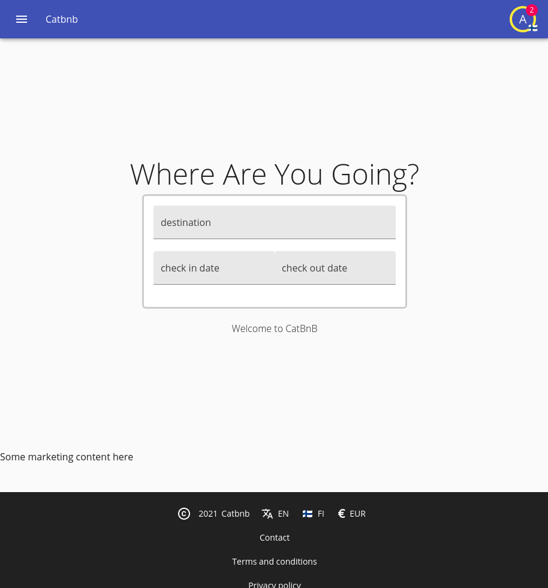
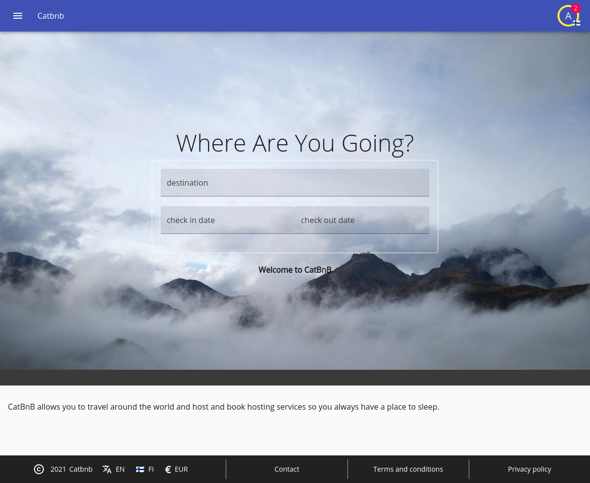
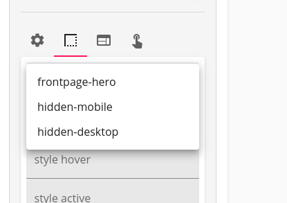
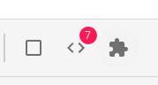
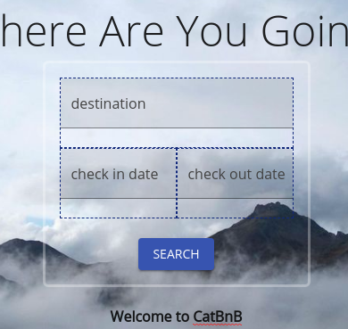
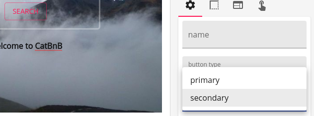
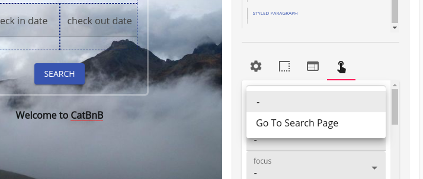

[Prev](./06-reservation.md)

# Redesign

So far our application works, but the UI/UX is absolutely awful; like have you seen what we have done so far? while it is probably good enough for a demonstration and in a prototyping standpoint, it's not good enough regarding the UI structure.

In itemize the UI is attempted to be as separate as possible to the application logic itself by the means of fragments, however not all can be resolved with fragments; primarily our entry renderers that are way too dynamic to be expressed by the means of a fragment template. Even when you could totally write a renderer that uses fragments.

In this section we will write our own custom renderers for several problematic sections; note that you should be able to write a custom renderer in any format you wish, but we will stick to material ui and fast prototyping methods, after all this is a tutorial.

## Story Time

You have shown your application to some prospect investors and it shows to have some potential, however this is not acceptable as a MVP, and you get assigned a designer and a manager to touch up the application and make it presentable.

Design meetings arise and many designs come to mind, ideas about A-B testing to measure engagement, and multiple views.

The implementation of the design falls on you the programmer, many time with hurries and deadlines; quite an inefficient process given that a lot of these views are first implemented in some form of image editor, discussed and then attempted implementation, rather than in app; it also requires programmer input and output where nothing should be required because this is a design criterian.

## Fragments to the Rescue

Fragments are not special, they are just a bit of text in a table, just another item and unlike users they do not hold some special meaning to itemize, you could drop them altogether, add more properties to them, whatever you fancy; by definition a fragment is just an item that holds some text that is supposed to be a template or represent a view.

Now as standard they are part of the cms module, and exist within `cms/fragment` where a lot of "fragment like" elements exist, such as articles, or other similar content.

Fragments are also used to define email templates, just as we pointed out during all this tutorial, but they can also be used to define views.

We will use fragments to resolve this situation, let's first take a look at a fragment that is already there, the header fragment, and the reason why our header right now doesn't display a thing.

Go to the cms, and check out the header fragment, and just write something in there, remembering to set a title; then go back to your home page.


Nice and all, but this header is rather disgraceful, no designer would accept the entry text tool to be plenty, however if you check `cms/index.propext.json` which specifies the properties in common of every element in the CMS (and for fragments), you will find out that the `content` property holds the following special attributes:

```json
{
    "mediaProperty": "attachments",
    "supportsImages": true,
    "supportsVideos": true,
    "supportsFiles": true,
    "supportsContainers": true,
    "supportsCustom": true,
    "supportsExternalLinks": true,
    "supportsLinks": true,
    "supportsQuote": true,
    "supportsRichClasses": true,
    "supportsTitle": true,
    "supportsCustomStyles": true,
    "supportsTemplating": true,
    "supportsLists": true
}
```

It supports images, videos, files, containers and custom (that basically means div containers that hold children), external links, normal links, quotes, rich classes (basically allows you to set `rich-text--` prefixed classes for custom styling), custom styles, templating (which is what makes it into a fragment and enables a pletora of features such as loops and context changes) and lists (ul, li, ol).

The text specs of itemize are a subset of html itself; while it is technically just HTML, it follows these rules in order to prevent invalid HTML as well vulnerabilities, it will strip any data that doesn't follow the norms; and while it seems like a subset is not enough to define all we need, it is actually more than plenty.

It is up to the text editor in use to allow the user and specify how to make this markup in a way that suits the norms, luckily the default fast prototyping text editor is very flexible and allows to use all of the specs (with the exception of UI handlers, which we won't need, they are for creating custom functionality such as mathjax and such), what we will focus on is creating templates.

While the fast prototyping editor isn't great as it tries to do everything, it is enough for the purposes of our demostration, let's take our basic header text and make it big and red, in the standard fast prototyping editor you need to click on `...` to bring the advanced features.

Now click on the square that represents the style and do `text-align:center; color:red; font-size:3rem;` yes this is basic css, and while this is a terrible way to input styles from an usability standpoint, this is what the fast prototyping editor provides.


Now accept the update and go back to your frontpage


However we are not interested on making these fragments by ourselves, that is the job of the designer after all, but we have to define a framework to enable that to be the case, let's divide our frontpage into two parts, the header, and the body; we do have already a fragment for our header, but we need one for the body, at `fragment.tsx` first, let's define a wrapper function:

```tsx
const frontpageWrapper = (children: React.ReactNode) => {
    return (
        <ModuleProvider module="hosting">
            <ItemProvider
                itemDefinition="unit"
                searchCounterpart={true}
                properties={[
                    "address",
                    "unit_type",
                    "planned_check_in",
                    "planned_check_out",
                    "price",
                ]}
            >
                {children}
            </ItemProvider>
        </ModuleProvider>
    );
}
```

This wrapper function determines an environment for templating purposes in a given context, we want to pass in these providers; now we want to define these properties:

```tsx
const frontpageProperties: { [key: string]: ITemplateArg } = {
    check_in_date_entry: {
        label: "Check in date Entry",
        type: "html",
        htmlDisplay: (<Entry id="planned_check_in" />),
    },
    check_out_date_entry: {
        label: "Check out date Entry",
        type: "html",
        htmlDisplay: (<Entry id="planned_check_out" />),
    },
    location_entry: {
        label: "Location Entry",
        type: "html",
        htmlDisplay: (<Entry id="address" searchVariant="location" rendererArgs={{disableMapAndSearch: true}} />),
    },
    search_radius_entry: {
        label: "Search Radius Entry",
        type: "html",
        htmlDisplay: (<Entry id="address" searchVariant="radius" />),
    },
    unit_type_entry: {
        label: "Unit Type Entry",
        type: "html",
        htmlDisplay: (<Entry id="unit_type" searchVariant="search" />),
    },
    min_price_entry: {
        label: "Min Price Entry",
        type: "html",
        htmlDisplay: (<Entry id="price" searchVariant="from" />),
    },
    max_price_entry: {
        label: "Max Price Entry",
        type: "html",
        htmlDisplay: (<Entry id="price" searchVariant="to" />),
    },
};
```

These are all for usage within templating, basically we are defining these arguments as custom HTML that we will be using, and these will be use to display as placeholder, we are using the actual fields that would be displayed, now we can actually define both of these for the body and the header.

```tsx
{
    "HEADER": {
        type: "context",
        label: "Header",
        wrapper: frontpageWrapper,
        properties: frontpageProperties,
    },
    "BODY": {
        type: "context",
        label: "Body",
        wrapper: frontpageWrapper,
        properties: frontpageProperties,
    },
}
```

What we are specifying is that in the header context the wrapper that is going to be used is the function we just defined, and that the properties available for templating are the ones we defined, for both of them.

Just note that the way we are templating here is specific to the slate based property view renderer we are using, which is why this context information is passed as a renderer arg and not as an arg specific to the entry, in itemize's perspective, the renderer is a black box that should spew valid HTML that follows the text specs; so if you ever decide to use a 3rd party editor, you will have to figure out the specifics regarding implementing your own renderer that can support what you need, the fast prototyping editor tries to support everything, and while it works, a custom option tailored for your needs might be better, however creating a custom editor is a complex task.

If you need to create your own editor you can use itemize source code, clone the editor code, and modify it from there, remove buttons, change the behaviour of templates, and create ui handled mechanisms.

Now back to our webpage, after building with webpack dev, we should find this section:


Going to our header we will find we have 7 html template bits to use, and if we do in fact insert them we will find out it renders just as if it was our default, we can now use containers and stack them and create whatever we want.


Now if we go to our actual frontpage, we will find that it doesn't look quite right, the contents are missing and it just looks off overall.

This is rightly because we have just told our edit renderer how to render this fragment using the available information, but when we are using it we are rendering it as it is; as raw plain html, rather than instantiating it as a template.

Let's remake our `frontpage/index.tsx` as a primarily fragment based mechanism based on our header and body.

```tsx
import React from "react";
import I18nRead from "@onzag/itemize/client/components/localization/I18nRead";
import TitleSetter from "@onzag/itemize/client/components/util/TitleSetter";
import Entry from "@onzag/itemize/client/components/property/Entry";
import View from "@onzag/itemize/client/components/property/View";
import { ModuleProvider } from "@onzag/itemize/client/providers/module";
import AppLanguageRetriever from "@onzag/itemize/client/components/localization/AppLanguageRetriever";
import { ItemProvider } from "@onzag/itemize/client/providers/item";
import { TemplateArgs } from "@onzag/itemize/client/internal/text/serializer/template-args";

const templateContextWrapper = (children: React.ReactNode) => {
    return (
        <ModuleProvider module="hosting">
            <ItemProvider
                itemDefinition="unit"
                searchCounterpart={true}
                properties={[
                    "address",
                    "unit_type",
                    "planned_check_in",
                    "planned_check_out",
                    "price",
                ]}
            >
                {children}
            </ItemProvider>
        </ModuleProvider>
    );
}

const templateArgs = (new TemplateArgs({
    check_in_date_entry: <Entry id="planned_check_in" />,
    check_out_date_entry: <Entry id="planned_check_out" />,
    location_entry: <Entry id="address" searchVariant="location" rendererArgs={{disableMapAndSearch: true}} />,
    search_radius_entry: <Entry id="address" searchVariant="radius" />,
    unit_type_entry: <Entry id="unit_type" searchVariant="search" />,
    min_price_entry: <Entry id="price" searchVariant="from" />,
    max_price_entry: <Entry id="price" searchVariant="to" />,
})).wrappedBy(templateContextWrapper);

/**
 * Provides the frontpage
 */
export function Frontpage() {
    return (
        <>
            <I18nRead id="app_name" capitalize={true}>
                {(i18nAppName: string) => {
                    return (
                        <TitleSetter>
                            {i18nAppName}
                        </TitleSetter>
                    );
                }}
            </I18nRead>
            <div className="trusted">
                <ModuleProvider module="cms">
                    <AppLanguageRetriever>
                        {(languageData) => (
                            <>
                                <ItemProvider
                                    itemDefinition="fragment"
                                    forId="HEADER"
                                    forVersion={languageData.currentLanguage.code}
                                    loadUnversionedFallback={true}
                                    longTermCaching={true}
                                    properties={
                                        [
                                            "content",
                                            "attachments",
                                        ]
                                    }
                                    static="NO_LISTENING"
                                >
                                    <View id="content" rendererArgs={{ makeTemplate: true, templateArgs }} />
                                </ItemProvider>
                                <ItemProvider
                                    itemDefinition="fragment"
                                    forId="BODY"
                                    forVersion={languageData.currentLanguage.code}
                                    loadUnversionedFallback={true}
                                    longTermCaching={true}
                                    properties={
                                        [
                                            "content",
                                            "attachments",
                                        ]
                                    }
                                    static="NO_LISTENING"
                                >
                                    <View id="content" rendererArgs={{ makeTemplate: true, templateArgs }} />
                                </ItemProvider>
                            </>
                        )}
                    </AppLanguageRetriever>
                </ModuleProvider>
            </div>
        </>
    );
}
```

Now we can remove both `hero.tsx` and `search.tsx` as we don't need them any further, if you check now your frontpage the view should have changed to the more appropiate look of:



Which is more like what we are aiming for, now let's try to go further and make it look nice; as you might realize these fragments support images so it is totally possible to add a new image to them and style them in the rich text editor itself.

We can keep working and polishing the frontpage and the body in the text editor and make it look such as:



We are going to drop more designing since it's out of the scope of this tutorial to design, but feel free to play with the rich text editor further and figure out its potential to design almost anything.

However there are limitations, for example there is no support for defining media queries since the styles of these components are set as inline, and we need to give our designer some resources and classes to work with, for example some responsive classes for usage with responsive design, since the text-specs do not support these.

Let's add some classes that our designer can take advantage of, let's go to the file that we have in our source code named `rich-extensions.scss` which is part of an imported styles that is included in our codebase and let's add the following extensions, note that they all must be prefixed with `rich-text--`.

```scss
.rich-text--hidden-mobile {
    @media only screen and (max-width: 500px) {
        display: none;
    }
}

.rich-text--hidden-desktop {
    @media only screen and (min-width: 501px) {
        display: none;
    }
}
```

In reality these classes should be more specific on what they want to achieve, but it's a start, after you have added and rebuilt they should be accessible, and you should be able to use them.



And they should indeed react and be responsive to the width of the screen.

However we now need a button to perform the search functionality, our inputs are nice and all, and we could indeed specify a component for the search, however we do actually want to go a new screen instead of remaining here in the frontpage to our search specific page.

## UI handlers

You might however notice that we are lacking a button to perform the search, and while it is possible to create the button by hand, using for example a paragraph, and make it look like a nice button, it might not be exactly what we want; and our UI/UX designer might be unhappy because the button option they are given is missing accessibility, and they still want a button, and well, we are using material ui so why aren't we having a button that looks like it as well.

This is where UI handlers come into play they are defined in text specs to provide templating features that go beyond the usual form, these allow for creation of dynamic content such as math formulas, custom component, and whatever other custom elements you fancy, UI handler are considered templating features since the element is not displayed as it is, but rather templatized with the content of the UI handler, even if you think they are the content itself, so the text content must support templating in order to support UI Handling.

Luckily our fragments are already templates, so we just need to define an ui handler, so let's create a file in `components/ui-handlers.tsx` and add a new ui handler there.

```tsx
import { IDrawerUIHandlerConfiguratorElement, ISlateTemplateUIHandlerProps, IToolbarPrescenseElement } from "@onzag/itemize/client/fast-prototyping/components/slate";
import { Button, ExtensionIcon } from "@onzag/itemize/client/fast-prototyping/mui-core";
import React from "react";

/**
 * This is the button ui handler itself
 * @param props the props are based on ISlateTemplateUIHandlerProps which extends
 * the IUIHandlerProps which allows you to create an edit mode for the button so this same
 * component can be used for both display mode and edit mode, you can technically use different
 * components for display and edit, and it's up to the editor what extra props to pass, the slate
 * edit ui handler manager was built so that it keeps compatibility with the text serializer
 */
export const button = (props: ISlateTemplateUIHandlerProps) => {
    // as you can see we just render a button
    return (
        <Button
            // these come from the arguments our template handler supports
            variant={props.args.type}
            color={props.args.color}
            // these come from the rich classes
            className={props.className}
            // we need to change the style if we are in slate to use a cursor text
            // note how we extend props.style this is because these are the styles given
            // by the configuration of the inline style, there is also styleActive and styleHover
            // but we are ignoring them
            style={props.isSlate ? { ...props.style, cursor: "text" } : props.style}
            // we need to change the touch ripple props if we are in slate because
            // we are inside a content editable then
            TouchRippleProps={props.isSlate ? {
                contentEditable: false,
                style: {
                    userSelect: "none",
                }
            } : null}
            // the events are what events have been added to the component
            // in the standard functions given in the context, so data-on-click
            // becomes onClick and provides a function and so on
            {...props.events}
            // these are attributes from slate given by the renderer if we
            // are in such mode
            {...props.attributes}
        >
            {props.children}
        </Button>
    );
}

/**
 * This is very specific to our fast prototyping editor, unlike our handler
 * which is compatible with our text serializer, it represents a button in the toolbar
 * that inserts a node, in our case, we want to add a button, and we are basing
 * ourselves off a paragraph for that, since that's the behaviour we want, if you need
 * to support children, it could be, for example, a container
 */
export const buttonToolbarPrescence: IToolbarPrescenseElement = {
    element: {
        type: "paragraph",
        containment: "block",
        children: [],
        uiHandler: "button",
        uiHandlerArgs: {
            type: "contained",
            color: "primary",
        },
    },
    icon: <ExtensionIcon />,
}

/**
 * These are also very specific to the fast prototyping editor, and represents
 * extra options to add to the general configuration drawer for the element, so if you
 * remember the uiHandler args we have two, type and color, this allows the drawer to modify
 * these args, if you use other editor other than the fast prototyping this might differ, however
 * we encourage other editors to still support these basic options
 */
export const buttonOptions: IDrawerUIHandlerConfiguratorElement[] = [
    {
        uiHandler: "button",
        arg: "type",
        input: {
            type: "select",
            label: "button type",
            placeholder: "button type",
            options: [
                {
                    label: "contained",
                    value: "contained",
                },
                {
                    label: "text",
                    value: "text",
                },
                {
                    label: "outlined",
                    value: "outlined",
                }
            ],
        }
    },
    {
        uiHandler: "button",
        arg: "color",
        input: {
            type: "select",
            label: "button color",
            placeholder: "button color",
            options: [
                {
                    label: "primary",
                    value: "primary",
                },
                {
                    label: "secondary",
                    value: "secondary",
                }
            ],
        }
    }
];
```

We have now defined our UI handler, which represents a button, as well as a button in the toolbar to insert such button and options to change how they are going to look and behave; as you can see this UI hanlder can be anything, including a math formula, and they can be even edited inline, rather than using the drawer, as that is what the `ISlateTemplateUIHandlerProps` provides and allows, and it's possible to hide the technical drawer so to only have inline editing.

Anyway we have just defined the UI handler but we need to add it to our rich text, just like text, functions, html, booleans, and so on, ui handlers are just like any other, they are a property in the context, so we need to define in both places, in our `fragment.tsx` at `frontpageProperties` we need to add it.

```tsx
{
    button: {
        label: "Button",
        type: "ui-handler",
        handler: button,
    }
}
```

As well as in `frontpage/index.tsx` as a template arg in `templateArgs`:

```tsx
const templateArgs = {
    check_in_date_entry: <Entry id="planned_check_in" />,
    check_out_date_entry: <Entry id="planned_check_out" />,
    location_entry: <Entry id="address" searchVariant="location" rendererArgs={{disableMapAndSearch: true}}/>,
    search_radius_entry: <Entry id="address" searchVariant="radius" />,
    unit_type_entry: <Entry id="unit_type" searchVariant="search" />,
    min_price_entry: <Entry id="price" searchVariant="from" />,
    max_price_entry: <Entry id="price" searchVariant="to" />,
    button,
}
```

And if we compile this it will work just fine, with the exception that we cannot add the UI handler at all, nor see any special configuration, and for that we need to give renderer specific options to our fast prototyping, that's our `buttonToolbarPrescence` and `buttonOptions` they need to be passed as rendererArgs in our cms, so at `cms/fragment.tsx`

```tsx
<Entry
    id="content"
    rendererArgs={{
        context: FRAGMENTS[fragmentId] || null,
        toolbarExtras: [
            buttonToolbarPrescence,
        ],
        drawerUIHandlerExtras: [
            ...buttonOptions,
        ],
    }}
/>
```

With that we are passing the information about a button that will insert a standard empty button from our toolbar.



And that button is fully editable once you insert it.



And if you check the general options you can see that you are provided with modification options as you had just defined them.



Note that is possible to provide labels using the `I18nRead` component so that you can keep internationalization.

## Actions

However now what we want to do is give an action such as the UI/UX designer is able to trigger an event once that button is clicked (or any other element), what we want to happen is to go to the search page, so we will create a function that takes us to the search page.

In our `fragment.tsx` we don't need to define much, this is a function we have available in a templating environment, so we define it.

```tsx
{
    go_to_search_page: {
        label: "Go To Search Page",
        type: "function",
    },
}
```

And now it should be available to set in our CMS.



However even if you save it with the modifications nothing is going to happen at all when we click the button anyway because we haven't set up an action attached to that, we only defined it as a template resource, but are not passing it as value, now let's go to `frontpage/index.tsx` and let's provide a redirect to a new page.


```tsx
const templateArgs = (new TemplateArgs({
  check_in_date_entry: <Entry id="planned_check_in" />,
  check_out_date_entry: <Entry id="planned_check_out" />,
  location_entry: <Entry id="address" searchVariant="location" rendererArgs={{disableMapAndSearch: true}}/>,
  search_radius_entry: <Entry id="address" searchVariant="radius" />,
  unit_type_entry: <Entry id="unit_type" searchVariant="search" />,
  min_price_entry: <Entry id="price" searchVariant="from" />,
  max_price_entry: <Entry id="price" searchVariant="to" />,
  button,
  go_to_search_page: () => localizedRedirectTo("reserve"),
})).wrappedBy(templateContextWrapper);
```

And if we rebuild this, our search should now work and take us to the reserve page, which doesn't exist as of now so you should get an empty page.

We should now define a new fragment regarding this new page, which will be similar to these frontpage props and args.

## Loops

Now we need to display the search results, and for such a mechanism we should use a loop, one of the features of the templating mechanism of itemize is the capability to create loops, however they as well need to be defined.

## Language Support

We have so far done everything in english, yet we haven't specified a locale, this is because we have using the "fallback" locale each time off these fragments, they try to load a versioned item but don't find it, so they go to the fallback, however, we have a multilingual website, so let's now make the spanish version of our header, which can be completely different!... press `ctrl + A` and copy all the text in our header and change the language with the button at the top left.