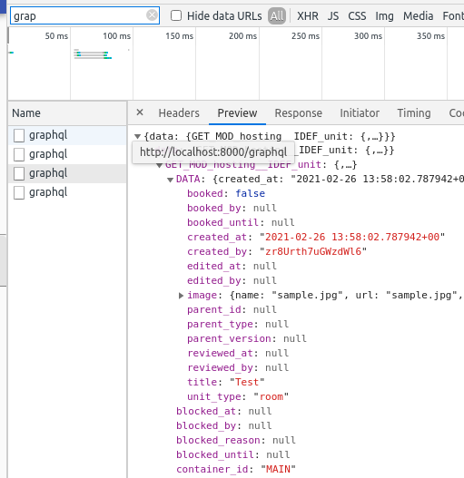
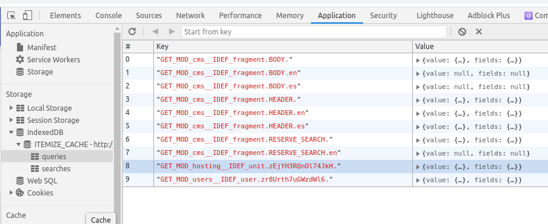
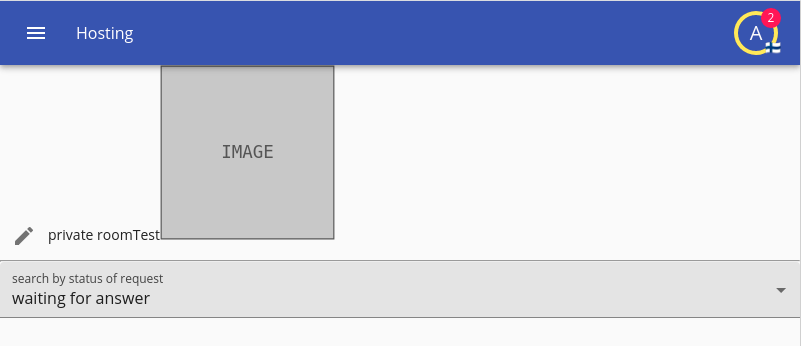
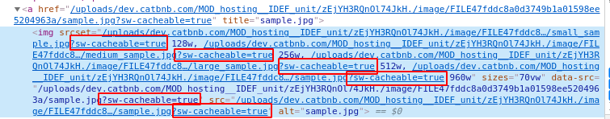
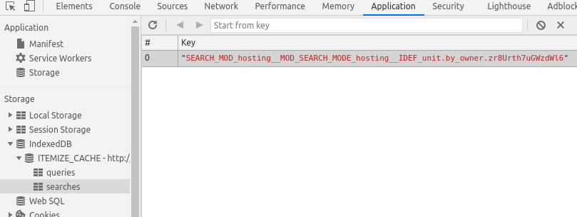
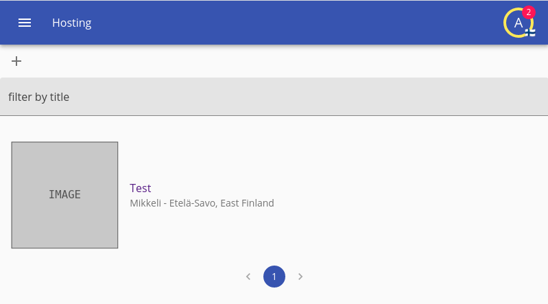

# Offline

Itemize was made with the consideration in mind for it to be a progressive web app that can work offline, making your application work properly offline should be one of your last considerations because working in a development mode in offline mode can be tricky and annoying.

You should not think about modifying your core client logic when doing this, and both your server and your client should be in sync, specially as we turn on SSR.

## Cache single elements

Before enabling SSR, first we need to think what we want to cache, what elements we want to cache in our client side, and I think that's clear, we want to cache our current user and all its data, we also want the properties that the user owns to be cached so it is visible.

Because we are using the fast prototyping navbar that setups the environment for our user, actually our user is already having long term caching enabled, however such is not the case for other item loader places, for example at `hosting/index.tsx` in the function `ViewHosting` we have elements that we are loading that are ours and we should think about caching.

And that is extremely simple, just add the `longTermCaching={true}` to our item provider, values will be stored in the cache, now let's check how that works by going "as it is" to our view page, which should look something like `http://localhost:8000/en/hosting/view/zEjYH3RQnOl74JkH` for example, just choose a property.

Go to your network tab, and filter by `graphql` you might notice one of the requests to be your unit.



Now add the `longTermCaching={true}` to the item provider that renders that view, and on the first load you will notice the same, but on the second load, you will find that one graphql request is not done, but where did the data come from?...

We can check that by going over the Application tab and checking your indexed db, Itemize DB, queries; you will find something that looks like the following:



However you might be concerned about that "private data" being cached, and existing in there, this is not like those fragments that are virtually public, but for that, we can mark the item for destruction on logout for that we use `markForDestructionOnLogout={true}` in the same place we used long term caching.

After we refresh we can go to our console and write `localStorage.DESTRUCTION_MARKERS` and you will find your unit id there, once the user logs out those elements will be wiped from the cache, there's also the user in there, because after all the user itself is sensitive data.

For testing that this all works and how it works, we need to reenable service workers, for chrome that's as simple as going to application, service workers, and re-enabling them given that we had them disabled, however, if you used the brute force mode you need to do `localStorage.setItem("DISABLE_SERVICE_WORKER", "false")` in order to renable them.

Refresh a couple of times, given that these workers being disabled were unable to cache the code, you might even need to kill your server, run `npm run build-data`, restart your server, and update the application as the application complains of being outdated; remember that `build-data` is the command that changes the build number of the application.

Now given that emulating offline is more annoying than not, we have a simple solution for that, kill the server, and refresh.

If you get an error in the console such as `DOMException: The requested version (1613991691777) is less than the existing version (1614347872788).` this means that the service worker is running an outdated version, this is something that can occur as an effect that the worker cached an old version and was never signaled of a version update, a byproduct of bruteforcing our development with service workers disabled; it should not occur in production, so do the `npm run build-data`, restart your server and let the app update.

Now after you refresh your page, it should look like this:



But something is wrong, there's a placeholder where there should be an image, what happened? didn't we just cache our element, yes we did, we cached the url, and the image source and sourceset is actually pointing to the right URL, but it can't be loaded because the service worker has determined that it is offline.

There's a way to cache the images too, a flag is added either in the headers or query string named `sw-cacheable` and making it equal to `true` however it is up to the handler to perform the caching, so in this case it is added as a property, we go to our View for the image and change it to:

```tsx
<View id="image" cacheFiles={true} />
```

Now because we have service workers enabled now, it is not enough to run webpack dev alone; we need to do a full blown build before restarting our server with `npm run build`

Your app will now complain of being outdated as you restart the server, let it update and now check how the image is loaded this time.



And now kill the server again to simulate offline and refresh, it works, at least that bit does.

And none of this caching will affect the realtime nature of itemize, as the application goes back online, things will be updated, and everything will be kept up to date within it.

## Cache search results

However we have just cached a single element with a specific id, what about searches, searches are a bit more complicated to cache and honestly only recommended when you really need it, in order to cache searches you need to specify a cache policy at the time you perform a search, currently there are three, `none` which is the default, `by-parent` and `by-owner`.

A `by-parent` cache search policy will cache a search by the parent item, it will download all the items that have a specific parent, and we really need to have access to them, it will put them into indexeddb and it will search from there, as you might imagine caching searches isn't meant for very large lists.

A `by-owner` cache search policy will cache a search by the user that owns such items, doing the same mechanism as by parent.

In the case of our list of units, we want to use a by owner because we are the owner of the items, the list of our units is in a different page from our current at the `UnitList` component, our automatic search should now have a `cachePolicy: "by-owner"` in it.

Now again using `npm run build` and expecting our application to complain we refresh, and go to `http://localhost:8000/en/hosting/` to see our unit list.

It all seems to work the same way, but it's anything but that, searches are now done against the cache, rather than against postgreSQL in the server side, and postgreSQL is more powerful on what it can do, so in the client side some functionality might behave differently right now, it is a trade off.

If you check your application cache, your search should be now on the cache.



Caching a search is heavy work as all the possible results must be cached as well, now one good thing about caching searches is that only the results remain having to keep themselves updated, which means that once they donwnload incremental updates and patches get sent by the server side rather than having to download all over.

So now if we do indeed kill the server and refresh without the server on, we get the same issue as before with the images, and we need to apply the same solution.



```tsx
<View
    id="image"
    rendererArgs={
        {
            // we do not want to link images with with <a> tags like
            // the active renderer does by default
            disableImageLinking: true,
            // we want the image size to load by 30 viewport width
            // this is used to choose what image resolution to load
            // so they load faster, we want tiny images
            imageSizes: "30vw",
            imageClassName: props.classes.image,
        }
    }
    // we turn on cache files
    cacheFiles={true}
/>
```

However same as before we want to ensure that this data is destroyed when we log out, we don't want a malicious agent accessing this data from the cache after the user logged out, the search parameters also allow for such mechanism.

So we add `markForDestructionOnLogout: true` to where we just added our cache policy.

We will see a similar effect now at `localStorage.SEARCH_DESTRUCTION_MARKERS` where our search will be marked for destruction, and our search has right now been offline enabled and secured.

## Some considerations

Yes our application is still not very well optimized for being used offline, things still fail to load and we need a refresh and revisit, there are many components and way you can deal with this, you can check if the app is offline with the `OfflineStatusRetriever` and show a different behaviour, and produce reloading icons when some non-cached item failed to load due to lack of connectivity.

Again this is too extensive to be covered by this tutorial alone, you should check the API for further offline optimizations.

## What you achieved

 1. Enabled offline support on single handpicked elements
 2. Enabled offline support for searches.
 3. Offline support was kept realtime.
 4. Usage of service workers to cache images.

## Next

[Next](./09-deployment.md)