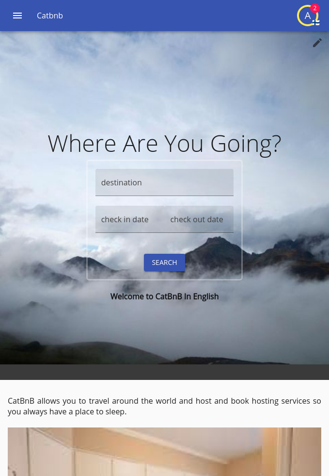
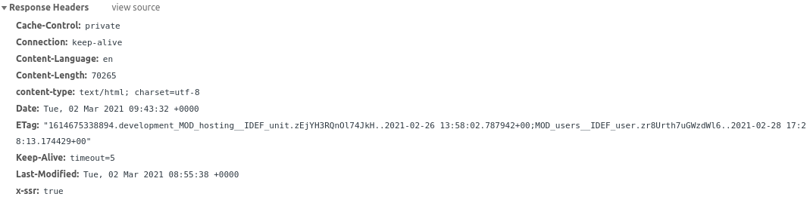
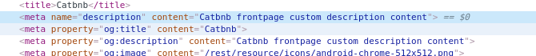

# Deployment

We have gone a long way, and we consider that our app is functional so we need to deploy it on a server, before having an app that is deployment worthy we need to do a couple of things first

## SEO Optimization

### SSR

One way to optimize for SEO and usability is to enable SSR, so far we have ran with SSR disabled because SSR is a pain to develop with, specially with service workers enabled.

SSR is what you prepare before doing the deployment the last step of the last, where you are not expected to change any source code regarding the client side unless it is a bug, because you need to rebuild your server and client in every scenario as they need to be in sync.

To enable SSR and do a cheap test you just simply turn it on, by removing the `NO_SSR` flag from the run, remember build everything, run `npm run build` and `npm run install`

You should realize that the website indeed seems to load faster, and that will impact SEO and the way your user sees the app.

What Itemize does under the hood is to use its own react dom renderer in order to understand what items you are loading and create a server side specific representation of what the user is going to recieve, it will also append the resources into a SSR specific global variable in the window that will signal the application to hydrate rather than render from scratch.

This means that even if SSR fails for some reason, say the code is invalid for the server side and cannot be SSRd; or data collection fails due to an outage, the application will still work it will just be sent the plain empty index page and asked to render from that.

If you examine your website now as it is with SSR enabled you will realize that it does in fact look exactly the same even when no javascript has executed at all.



That is what the browser is recieving on first paint, and it will enable robots to find and explore this content as well as rank the page high in SEO because of the fact it displays useful content quickly.

Every page with itemize is SSR enabled by default, if you have some special need you can use the `NoSSR` component, eg. if you are doing direct dom manipulation or whatnot, for example the leaflet map cannot be SSRd and as such it has a mechanism in place to avoid being hydrated, you need to keep everything you write SSR capable but that should be rather easy when all the async sources fetching and state management is heavy lifted by itemize itself.

#### SSR and Cache

SSR will also handle things like calculate when a page was last modified based on the items it is loading and the build number of the application itself so when a robot asks for that page and provides an etag, and the cache control headers.



The `x-ssr` flag tells that it was rendered using SSR, and the Etag is actually made in a human readable way and tells you about the resources that were accessed and the times of these resources, it is a signature after all.

The SSR generator will also return a `304 not modified` response if given an etag to compare against, this means that on top of the service worker cache, there's standard HTTP layer caching, but it's only active if the SSR can be executed; so a rule of thumb is that each page can be executed on the server side.

### SEO

The more powerful SEO features actually requires some modification in your server side, Itemize likes to do a very aggressive SEO mechanism where everything that you want to SEO is loaded in the sitemaps, so not only you have the standard SEO (specially after SSR is enabled) that uses a spider mechanism to grab all the links.

#### Automatic SEO

Automatically itemize will take care of language optimization such as `hreflang`, `lang` at the html level, and viewport configuration which will empower SEO in the many different configurations it can take, this is after all, the bare minimum.

This is not affected by the `NO_SEO=true` flag, since it's not considered an optimization by itemize standards but rather the bare minimum.

There's also the manifest, which is generated based on the configuration you have given the configuration in the config json file.

```html
<link rel="manifest" href="/rest/resource/manifest.en.json">
<meta name="msapplication-TileColor" content="#000000">
<meta name="msapplication-config" content="/rest/resource/manifest/browserconfig.xml">
<meta name="theme-color" content="#000000">
```

#### SSR Based SEO (client side)

When SSR is enabled we can use the `OgImageSetter`, `TitleSetter` and the `DescriptionSetter` in order to setup SEO tags for a given page, these can be added anywhere in the code.

This is not affected by the `NO_SEO=true` flag, since it's not considered an optimization by itemize standards.

By default itemize will add the following markup.

```html
<meta name="description" content="Catbnb">
<meta property="og:title" content="Catbnb">
<meta property="og:description" content="Catbnb">
<meta property="og:image" content="/rest/resource/icons/android-chrome-512x512.png">
<meta name="application-name" content="catbnb">
```

These are modifiable when we utilize those tags, so far we have been using the title setter for example which sets up a very important SEO tag for the title, but we can also affect most of these tags and change their content, including the `og:image` by providing a field.

For example let's add an `og:description` and meta `description` based on a custom content we will put in `root.properties`

```properties
app_frontpage_description = catbnb frontpage custom description content
```

And in spanish

```properties
app_frontpage_description = catbnb página de entrada contenido customizado
```

And now we need to redefine our `frontpage/index.tsx` under our title setter functionality.

```tsx
<I18nRead id="app_frontpage_description" capitalize={true}>
    {(i18nAppFrontpageDescription: string) => {
        return (
            <DescriptionSetter>
                {i18nAppFrontpageDescription}
            </DescriptionSetter>
        );
    }}
</I18nRead>
```

And after we run all `npm run install && npm run build` since now we have service workers enabled and all the hardcore caching on and restart the server, we should be able to see our description in our source (note it is invisible for the user, as only robots can read it).



We can do the same for the `og:image` which will allow us to even put a file property instead, right now the image is basically just the favicon.

#### Sitemaps and robots.txt (server side)

In order to do this part we need to enable SEO by removing the `NO_SEO=true` from our initialization this is because sitemaps are heavy and require some configuration, if we right now remove it we will see how it is going to setup `robots.txt` and the sitemap object, note that sitemaps are built upon, and they don't delete past information, so you might want to delete all your sitemap information if you need sitemaps to be rebuilt.

Now let's remove the `NO_SEO=true` and start the server as god intented with `npm run start-dev-server` alone and we might not realize it but something called the SEO generator has just kicked in, in order to explore what it has done, let's go to `http://localhost:8000/robots.txt`

And this is what we find:

```robots.txt
user-agent: *
disallow: /rest/util/*
disallow: /rest/index-check/*
disallow: /rest/currency-factors
disallow: /graphql
Sitemap: https://dev.catbnb.com/uploads/sitemaps/dev.catbnb.com/index.xml
```

You might notice that your sitemap url doesn't look right, we are running on localhost, but the url says `dev.catbnb.com` this is because by the specification on sitemaps, we must use absolute urls, and since our server has no clue it is running from localhost, it has no remedy but use the hostname it think it is currently running; anyway, this won't affect production, better try `http://localhost:8000/sitemap.xml`

And we will then find ourselves redirected to `http://localhost:8000/uploads/sitemaps/dev.catbnb.com/index.xml` where you see more of the same problem of absolute urls, as again there's no option due to the nature and specification on sitemaps, if you are concerned about this and you only do development in `localhost:8000`, then you can change the `config/index.json` `developmentHostname` property to be localhost.

Another way is defining a host in your host files, we however do not recommend doing that, because in localhost, service workers can run; but not on a custom host unless you have HTTPS; so we rather, just deal with these wacky urls, at least in development.

Anyway in a real life production scenario, specially a multicluster build, this upload will be provided by your data provider, and the urls could be absolutely different, anyway the XML in it should look like:

```xml
<sitemapindex xmlns="http://www.sitemaps.org/schemas/sitemap/0.9">
    <sitemap>
        <loc>https://dev.catbnb.com/uploads/sitemaps/dev.catbnb.com/en/index.xml</loc>
    </sitemap>
    <sitemap>
        <loc>https://dev.catbnb.com/uploads/sitemaps/dev.catbnb.com/es/index.xml</loc>
    </sitemap>
</sitemapindex>
```

This is because we have two language versions of our app, and our app is supposed to be symmetrical, now let's try to go to the english version, at `http://localhost:8000/uploads/sitemaps/dev.catbnb.com/en/index.xml` (remember that the absolute url was created with the dev hostname specifications and we can't access it unless we rewrite into localhost)

Now we find ourselves with this, another index:

```xml
<sitemapindex xmlns="http://www.sitemaps.org/schemas/sitemap/0.9">
    <sitemap>
        <loc>https://dev.catbnb.com/uploads/sitemaps/dev.catbnb.com/en/static.xml</loc>
    </sitemap>
    <sitemap>
        <loc>https://dev.catbnb.com/uploads/sitemaps/dev.catbnb.com/en/09_02_18.02_03_2021.xml</loc>
    </sitemap>
</sitemapindex>
```

On the first one there is not much but our frontpage.

```xml
<urlset xmlns="http://www.sitemaps.org/schemas/sitemap/0.9">
    <url>
        <loc>https://dev.catbnb.com/en/</loc>
    </url>
</urlset>
```

On the second one you have this strange url.

```xml
<urlset xmlns="http://www.sitemaps.org/schemas/sitemap/0.9">
    <url>
        <loc>https://dev.catbnb.com/en/profile/zr8Urth7uGWzdWl6</loc>
    </url>
</urlset>
```

But what is it? and how it came to be?... well if we head to `localhost:8000/en/profile/zr8Urth7uGWzdWl6` we will find our admin user public profile (you might remember other users but during the writting on this section of the tutorial the database was wiped and there was only the admin user).

Now why only these two urls?... well that has to be with our SEO sitemap rules specified in the server side about collection of data.

```typescript
{
    seoRules: {
        "/": {
            crawable: true,
        },
        "profile/:id": {
            crawable: true,
            collect: [
                {
                    module: "users",
                    item: "user",
                },
            ],
        },
    },
}
```

While crawling users and their ids is iffy, but that's fine, this is just a tutorial, now let's say we want to add a new sitemap rule, to crawl our `/reserve/:id` urls that specify what we need.

```typescript
{
    seoRules: {
        "/": {
            crawable: true,
        },
        "profile/:id": {
            crawable: true,
            collect: [
                {
                    module: "users",
                    item: "user",
                },
            ],
        },
        "reserve/:id": {
            crawable: true,
            collect: [
                {
                    module: "hosting",
                    item: "unit",
                },
            ],
        }
    },
}
```

By default the default parametrizer will just take all the arguments id and version and make it be parameters, for `:id` and `:version`, but our SEO collector allows way more functionality, and we can define our custom args and custom ways to make those parameters be with a parametrizer, we can ignore versioned, and we can even permute into different collections (eg. a comparison tool) yes, we could sitemap every different comparison of every single element if we wanted to.

For now this will work for what we want to achieve, let's run `npm run install` and restart the server and explore our new sitemap.

```xml
<sitemapindex xmlns="http://www.sitemaps.org/schemas/sitemap/0.9">
    <sitemap>
        <loc>https://dev.catbnb.com/uploads/sitemaps/dev.catbnb.com/en/static.xml</loc>
    </sitemap>
    <sitemap>
        <loc>https://dev.catbnb.com/uploads/sitemaps/dev.catbnb.com/en/09_02_18.02_03_2021.xml</loc>
    </sitemap>
    <sitemap>
        <loc>https://dev.catbnb.com/uploads/sitemaps/dev.catbnb.com/en/10_06_02.02_03_2021.xml</loc>
    </sitemap>
</sitemapindex>
```

There it is our new entry

```xml
<urlset xmlns="http://www.sitemaps.org/schemas/sitemap/0.9">
    <url>
        <loc>https://dev.catbnb.com/en/reserve/zEjYH3RQnOl74JkH</loc>
    </url>
</urlset>
```

And you got it, an incredibly aggressive SEO mechanism that will sitemap every single bit of your page; note that this SEO recalculation (which is additive) will run based on the `SERVER_MAPPING_TIME` which you can configure, however it runs immediately on server start.

## Dumping the content

You might realize that our fragments are right now in the database and once you want to deploy this application they will not come in our environment, they exist in our development environment alone and nowhere else.

For that we might want to dump the database bits that are relevant, and in the case of our app these are the fragments which we wish to dump, we would first want to check the dump file in order to see what is to be dumped, at `config/dump.json` and we find:

```json
{
  "save": {
    "cms": {
      "fragment": true
    }
  },
  "load": {
    "primaryContainerId": "MAIN"
  }
}
```

Now we notice that there are two options, how to dump, and how to load dumped content, we have to remember that there are multiple containers that can be had when we are loading in our CDN that will store the files, which is why it's important to specify how we are loading, we can map versions to container as well as map containers to container, but for now we will leave it as it is.

Let's give it a try to this dump configuration that already contains the fragments and see what happens, via `npm run build-database development dump`

We will notice that there's now a folder named `dump` in our project and it contains a file named `dump.json` and a folder named `MOD_cms` which contains the file structure for the images that you used in your fragments.

If you open the `dump.json` file you might notice that our spanish and english versions are there in the dump itself, and let's say we don't want that, we don't want the localized versions, only the raw versions so the designers can work on the specific localized versions, we want to modify how we are writting our dump.

```json
{
  "save": {
    "cms": {
      "fragment": "only-unversioned"
    }
  },
  "load": {
    "primaryContainerId": "MAIN"
  }
}
```

And now we have a dump, and we are ready to generate our first cluster.

## Deployable

Itemize by default creates a docker build of the project you are working on by creating a so called "deployable", there is a build script that will create a deployable of your file using the production environment; at the time of writting this tutorial, the default uses docker compose, that while some people prefer technologies such as swarm, or kubernetes; this is simply enough and what is available at this time, you can feel free to adapt the deployable for a more complex infraestructure.

At its core it is simply a group of docker elements, usually when you want to get a cluster you will use a standard cluster, and have your global manager, a standalone centralized fully managed postgresql database as the main source of truth and a redis managed database for the events and the server data, we also would have several servers for storing our file data according to the container logic, all scattered around the countries you want to serve, and you will create all these standard clusters and clone them using GeoDNS to connect the users to these.

But this is how itemize is supposed to scale, we are a broke startup and we have a 2GB ram desktop from 2006 that we want to run our server on, we cannot afford this, we cannot make a CDN, we cannot get a fully managed database; no problem, just build a full deployable that will run on its own, store files on the hard drive and just make it work.

In order to be able to build our deployable we need a npm token, this is because if you are using private packages this is necessary, and it was setup that way to require a npm token anyway, check `https://docs.npmjs.com/creating-and-viewing-access-tokens` and create a readonly npm token for your account, or your business account, and put it at a file named `.npm-token` which while odd of a name, it is because the dockerfile uses it as that name, and it's not meant to be used by your current project in development mode.

So in order to get our cheap first cluster we can run `npm run get-deployable production MAIN full` where `MAIN` is just the name of our deployable.

You will be requested your password several times, building the deployable is actually rather slow because the cache is disabled (during testing there were problems with the docker cache), anyway making a deployable is not something you do often.

## Local Test Run

Now we have a deployable, at `deployments/MAIN` let's check what we got, first we have `app.tar.gz` a file that represents your app docker image is around 250MB because it contains your app and `node_modules` which as we all know takes a lot of space, then we have `config` which contains your configuration for that version only, then you have two docker compose files, the normal one and another one that contains only the database, this file is based on your root level `docker-compose.yml` file, then you should have your dump folder, a logs folder, `nginx.conf` and `nginx-ssl.conf` which represent both your normal and SSL configuration for starting your app, `nginx-logs`, a README file, and a couple of scripts.

The first thing we want to do is to stop our dev environment via `npm run stop-dev-environment development` at the root level of our project, and then let's check what the `README` has to say.

So we first do `docker load -i app.tar.gz` and that should go fine, and now let's do `docker-compose -f docker-compose-only-db.yml up -d` because we want to setup our dump and our database, and then run `dir=${PWD##*/}; docker run -it --network "${dir,,}_default" -v $PWD/config:/home/node/app/config -e NODE_ENV=production -e INSTANCE_MODE=BUILD_DATABASE app:latest` to setup the database and `dir=${PWD##*/}; docker run -it --network "${dir,,}_default" -v $PWD/config:/home/node/app/config -v $PWD/dump:/home/node/app/dump -v $PWD/uploads:/home/node/app/uploads -e NODE_ENV=production -e INSTANCE_MODE=LOAD_DATABASE_DUMP app:latest` to load the database dump.

In an optimal scenario where our database is managed we would run these commands from our development environment using `npm run build-database production` and `npm run build-database production load-dump` which would do the exact same, but these are dockerized environemnt so we use cheat scripts, but that's the equivalent procedure.

Now we can stop our docker compose detached instance given that it's ready with `docker-compose down`

And it's time to start an instance because we have no ssl and we will be running in localhost, we will use `bash start.sh 3` you might need sudo, the number 3 is the number of extended nodes that make up your cluster.

Now go to `localhost` without the port, and that is it; that is our app, running in production mode in one cluster mode, blazingly fast.

## Nginx and SSL

Our cluster uses Nginx as a reverse proxy load balancer by default, in order to enable SSL you need to setup your `key.pem` and your `cert.pem` and start with `start-ssl.sh`

## Debugging in production

You might notice that these are production builds, if we check our sources they are all compressed gibberish, usually you might setup sourcemaps, but maybe you would rather use the full blown development mode, with all the toolkit that a development build contains; but this is production, and our code is seriously obfuscated via the minification mechanism.

There's a way to access our full blown development build while losing SSR functionality and image loading capacities since the domain resolving is going to fail as it will try to resolve to the development domain (if you need the image loading to still work you should modify the development hostname from `dev.catbnb.com` to the production `catbnb.com` in your cluster config so it can resolve at the same domain), SSR also only works in one mode so it cannot function in both production and development at the same time, and it is functioning in production mode (so you cannot debug SSR issues like this) but anything else should work as usual, this is via the `devKey`, check your dev key in your config, it should look something like `okQoqIj6MhrFfRmB` and we will go to our developent console in our website and use it via `SET_DEV_MODE("development", "okQoqIj6MhrFfRmB");` this will setup a cookie.

In order to turn back to the production mode, either clear the cookies or call `SET_DEV_MODE("production", "okQoqIj6MhrFfRmB");` in your console.

## Find your admin user

You don't have an admin user yet, so let's find it, check your logs for the global manager such as `

Look for a line like:

```json
{"username":"admin","password":"69b27c40c9e941cabcbd5fff21a522df","level":"info","message":"GlobalManager.addAdminUserIfMissing: Sucessfully added admin user","timestamp":"2021-03-03T20:01:17.335Z"}
```

And that's your password for the default admin user.

## Singlecluster builds and its relation to file management

Note that singlecluster builds like this are the only ones that can work with the local storage `uploads` as a file mechanism, for anything that goes beyond 1 cluster it is necessary to use a standalone solution, Itemize for example supports openstack for this, you can have many openstack instances and relate them to containers, and relate these containers to countries; that way you have an automatic CDN.

## GeoDNS

Clusters communicate automatically using redis and postgreSQL as their source of truth so in multi cluster builds, they will keep each other syncronized; however each cluster should have their own IP address, and you will use GeoDNS in order to add and remove servers to these list, according to the user location you will send them to one specific cluster.

This way a user in USA for example will be answered with a DNS answer for the USA cluster, where one in say, Finland, will be answered with the Finnish cluster.

File containers on the other hand are unrelated to this, users have to access them directly from the container they are located at, so files that are used by say, your German customer base, are might be located at a EU level container, while the cluster is in Austria; while your Indian userbase can have a cluster and a file container at the same place; the GeoDNS configuration applies only for the clusters, as all clusters are meant to be equal.

What you need to ensure, all the time is that clusters run based on the same build numbers, otherwise the experience can be odd, clusters are meant to run on the same logic, otherwise the data can be conflicting, and they might try to write stuff that makes no sense to the database.

Itemize scales primairly horizontally, just make more clusters, and they don't care where they run at; you can also scale vertically by adapting the scale of each cluster, GeoDNS should be able to spot if a cluster is down, and choose a valid cluster, so you keep resilliance since clusters are independent.

## What you achieved

 1. Enabled SSR support on the website.
 2. Perfomed Search Engine Optimization.
 3. Created a docker cluster and ran it.

## Next

[Next](./10-beyond.md)