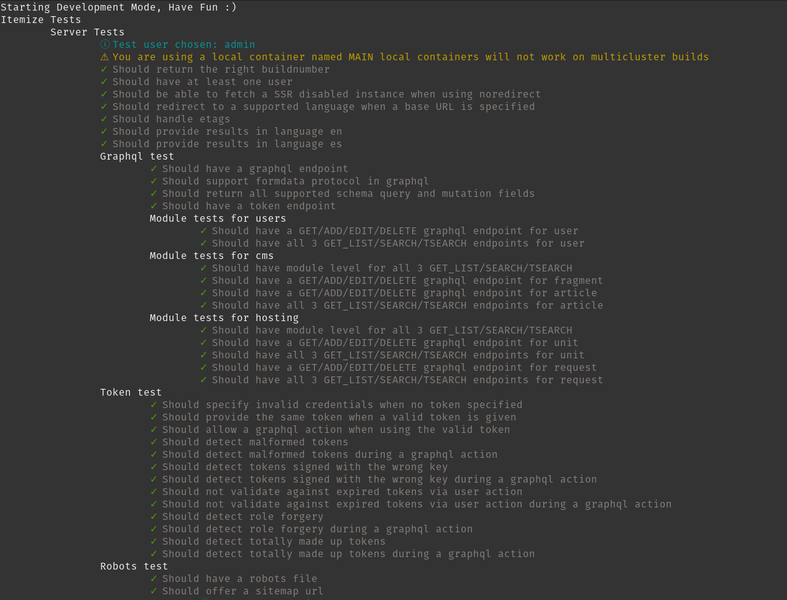

# Beyond this tutorial

There are things not covered in this tutorial that might have proven useful for building an app more meant for the real world, as this was supposed to be a crash course on how to use all the features of itemize, even the rarer ones, and I tried not to repeat myself.

Feel free to implement them yourself if you wish to, but they are considered out of scope.

## Reviews

Reviews could have been achieved by writting a rewiew schema and having a trigger that creates a review, 

## Price locking and a payment mechanism

As the time of writting of this tutorial itemize did not have the payment type, however it is absolute possible to use custom rest endpoints to process the payment of a request, that is a lot like going back to the basics of processing the payment all by yourself. Check out the API to figure out how to write custom rest endpoints and having them affect the underlying itemize data, by requesting updates via the cache layer; it should remain being realtime and keep its offline functionality when done properly via a custom rest endpoint.

If itemize already has a payment type, with its own provider and fast prototyping renderer that you must configure yourself, then it should just be a matter of creating a payment type linked to a currency property and having a trigger change the status of the request once it fullfills.

## Testing

Itemize comes with a default testing mechanism, and it doesn't use a default testing library as tests can be automatically generated so it uses its own testing methodology where tests are child of each other and execute in order, they analyze the information you have and work based on that, while it might not be the best way to test rather than manually writting tests for each little feature, this is better than nothing, and it can actually catch errors.

At the time of the writting of this tutorial, tests are a feature in development but the mechanism to start them would be via the script `npm run test-development` while you have a standard development build going on with the dev environment and the start-dev-server with SSR and SEO enabled.

The development server is recommended for tests because it has tools in it that allows to test more stuff than a production server, there's also `npm run test-production` to test against a production build.

This is what a standard testing looks like.

The file that specifies these tests resides in `tests/index.js`